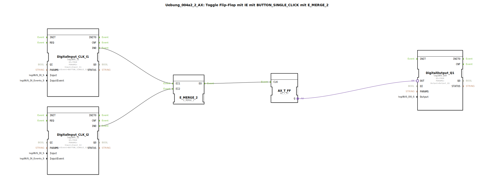

# Uebung_004a2_2_AX: Toggle Flip-Flop mit IE mit BUTTON_SINGLE_CLICK mit E_MERGE_2

* * * * * * * * * *
## Einleitung

Diese Übung realisiert ein Toggle-Flipflop (T-FF), das durch zwei unabhängige Taster (Eingänge I1 und I2) umgeschaltet wird. Jeder Taster löst ein Ereignis „BUTTON_SINGLE_CLICK“ aus. Die beiden Ereignisse werden mithilfe eines `E_MERGE_2`-Bausteins zusammengeführt und dienen als Taktsignal für das T-FF. Der Ausgang des T-FF steuert einen digitalen Ausgang (Q1).

## Verwendete Funktionsbausteine (FBs)

- **DigitalOutput_Q1**  
  - **Typ**: `logiBUS::io::DQ::logiBUS_QXA`  
  - **Parameter**:  
    - `QI` = TRUE  
    - `PARAMS` = ""  
    - `Output` = `Output_Q1`  
  - **Beschreibung**: Stellt den digitalen Ausgang Q1 bereit. Der Ausgangswert wird über den Adaptereingang gesetzt.

- **DigitalInput_CLK_I1**  
  - **Typ**: `logiBUS::io::DI::logiBUS_IE`  
  - **Parameter**:  
    - `QI` = TRUE  
    - `PARAMS` = ""  
    - `Input` = `Input_I1`  
    - `InputEvent` = `BUTTON_SINGLE_CLICK`  
  - **Beschreibung**: Liest den digitalen Eingang I1 und erzeugt bei einem kurzen Tastendruck (Single Click) ein Ereignis `IND`.

- **DigitalInput_CLK_I2**  
  - **Typ**: `logiBUS::io::DI::logiBUS_IE`  
  - **Parameter**:  
    - `QI` = TRUE  
    - `PARAMS` = ""  
    - `Input` = `Input_I2`  
    - `InputEvent` = `BUTTON_SINGLE_CLICK`  
  - **Beschreibung**: Liest den digitalen Eingang I2 und erzeugt bei einem kurzen Tastendruck ein Ereignis `IND`.

- **E_MERGE_2**  
  - **Typ**: `iec61499::events::E_MERGE_2`  
  - **Parameter**: Keine  
  - **Beschreibung**: Vereinigt zwei Ereigniseingänge (EI1, EI2) zu einem gemeinsamen Ereignisausgang (EO). Sobald an einem der beiden Eingänge ein Ereignis anliegt, wird es an den Ausgang weitergegeben.

- **AX_T_FF**  
  - **Typ**: `adapter::events::unidirectional::AX_T_FF`  
  - **Parameter**: Keine  
  - **Beschreibung**: Ein Toggle-Flipflop als Adapter. Bei jedem Ereignis am Eingang `CLK` wechselt der Ausgang `Q` seinen Zustand (0→1, 1→0).

## Programmablauf und Verbindungen

Das System arbeitet ereignisgesteuert. Sobald der Benutzer den Taster an Eingang I1 oder I2 kurz drückt, erzeugt der entsprechende `DigitalInput`-Baustein ein Ereignis `IND`. Diese beiden Ereignisse werden über den `E_MERGE_2`-Baustein zusammengeführt – unabhängig davon, welcher Taster gedrückt wurde, löst das `E_MERGE_2` ein Ereignis an seinem Ausgang `EO` aus. Dieses Ereignis wird direkt an den Takteingang `CLK` des T-FF (`AX_T_FF`) weitergeleitet. Das T-FF toggelt seinen Ausgangszustand bei jedem eingehenden Ereignis. Der aktuelle Zustand `Q` des T-FF wird über eine Adapterverbindung an den digitalen Ausgang `DigitalOutput_Q1` übergeben, der den physischen Ausgang Q1 ansteuert.

**Verbindungsübersicht**:

- Ereignisverbindungen:  
  - `DigitalInput_CLK_I1.IND` → `E_MERGE_2.EI1`  
  - `DigitalInput_CLK_I2.IND` → `E_MERGE_2.EI2`  
  - `E_MERGE_2.EO` → `AX_T_FF.CLK`  

- Adapterverbindungen:  
  - `AX_T_FF.Q` → `DigitalOutput_Q1.OUT`  

## Zusammenfassung

Die Übung demonstriert die Kombination von zwei Ereignisquellen (Taster) mit einem `E_MERGE_2`-Baustein zur Erzeugung eines gemeinsamen Taktsignals für ein Toggle-Flipflop. Der Ausgangszustand des Flipflops kann durch beliebiges Drücken der beiden Taster umgeschaltet werden. Dies ist ein grundlegendes Beispiel für die ereignisgesteuerte Logik in 4diac und die Verwendung adaptierbarer I/O-Bausteine aus der logiBUS-Bibliothek.