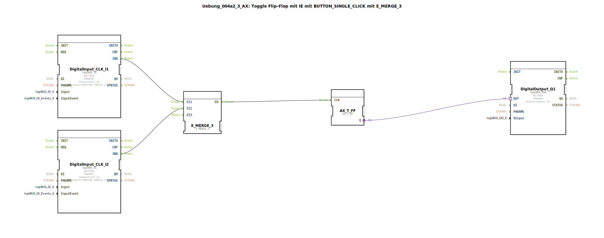

# Uebung_004a2_3_AX: Toggle Flip-Flop mit IE mit BUTTON_SINGLE_CLICK mit E_MERGE_3

* * * * * * * * * *
## Einleitung

Diese Übung realisiert ein **Toggle Flip-Flop** (T-FF), das über zwei separate Taster (Eingänge I1 und I2) gesteuert wird. Die Taster werden als **BUTTON_SINGLE_CLICK** konfiguriert, d.h. jeder Tastendruck erzeugt genau ein Ereignis. Die Ereignisse beider Taster werden über einen **E_MERGE_3** Baustein zusammengeführt und an den Takteingang (CLK) des T-FF weitergeleitet. Der Ausgang Q des T-FF schaltet einen digitalen Ausgang (Q1). Das Schaltverhalten: Jeder Tastendruck (egal von welchem Taster) toggelt den Ausgangszustand.

Die Übung demonstriert die Kombination von Hardware-Eingangsbausteinen mit Ereignisverarbeitung und einem Adapter-basierten Flip-Flop.

## Verwendete Funktionsbausteine (FBs)

Im Netzwerk werden folgende Funktionsbausteine eingesetzt:

- **DigitalOutput_Q1** – Typ: `logiBUS::io::DQ::logiBUS_QXA`
    - Parameter: `QI` = `TRUE`, `Output` = `Output_Q1`
    - Aufgabe: Stellt den digitalen Ausgang Q1 bereit. Der Ausgangswert wird über den Adaptereingang `OUT` gesetzt.
- **DigitalInput_CLK_I1** – Typ: `logiBUS::io::DI::logiBUS_IE`
    - Parameter: `QI` = `TRUE`, `Input` = `Input_I1`, `InputEvent` = `BUTTON_SINGLE_CLICK`
    - Aufgabe: Erfasst den Taster an I1. Bei jedem Tastendruck wird das Ereignis `BUTTON_SINGLE_CLICK` ausgelöst und ein IND-Ereignis am Ausgang gesendet.
- **DigitalInput_CLK_I2** – Typ: `logiBUS::io::DI::logiBUS_IE`
    - Parameter: `QI` = `TRUE`, `Input` = `Input_I2`, `InputEvent` = `BUTTON_SINGLE_CLICK`
    - Aufgabe: Erfasst den Taster an I2. Gleiche Funktionsweise wie der Baustein für I1.
- **AX_T_FF** – Typ: `adapter::events::unidirectional::AX_T_FF`
    - Parameter: keine zusätzlichen
    - Aufgabe: Adapterbaustein, der ein T-Flip-Flop realisiert. Bei jedem Ereignis am CLK-Eingang wird der interne Zustand umgeschaltet. Der Ausgang Q (Adapter) gibt den aktuellen Zustand aus.
- **E_MERGE_3** – Typ: `iec61499::events::E_MERGE_3`
    - Parameter: keine zusätzlichen
    - Aufgabe: Ereigniszusammenführung. Die drei Ereigniseingänge (EI1, EI2, EI3) werden logisch ODER-verknüpft; bei jedem eingehenden Ereignis an einem der Eingänge wird ein Ereignis am Ausgang EO ausgegeben. In dieser Übung werden nur zwei Eingänge (EI1, EI2) verwendet; der dritte bleibt unbeschaltet.

## Programmablauf und Verbindungen

Die Verdrahtung arbeitet wie folgt:

1. **Eingangsereignisse**: Die beiden DigitalInput-Bausteine erzeugen bei Betätigung des jeweiligen Tasters ein IND-Ereignis (Tastendruck erkannt).
2. **Ereignis-Merge**: Die IND-Ereignisse werden zu `E_MERGE_3` geführt:
   - `DigitalInput_CLK_I1.IND` → `E_MERGE_3.EI1`
   - `DigitalInput_CLK_I2.IND` → `E_MERGE_3.EI2`
   - Der dritte Eingang (EI3) ist nicht verbunden (laut Kommentar ist dies zulässig).
3. **Takt für das Flip-Flop**: Das zusammengeführte Ereignis (`E_MERGE_3.EO`) ist mit dem CLK-Eingang des T-FF (`AX_T_FF.CLK`) verbunden. Jeder Tastendruck löst somit ein Taktereignis aus.
4. **Ausgang**: Der Adapterausgang `AX_T_FF.Q` ist mit dem Eingang `OUT` des DigitalOutput-Bausteins verbunden. Der Zustand des Flip-Flops wird direkt auf den digitalen Ausgang Q1 gegeben.

**Verhalten**: Bei jedem Tastendruck (I1 oder I2) wechselt Q1 seinen Zustand (von 0 → 1 oder 1 → 0). Das entspricht einem typischen Toggle-Flip-Flop.

## Zusammenfassung

Die Übung zeigt, wie ein **Toggle Flip-Flop** mit Hilfe eines Adapterbausteins (`AX_T_FF`) und Ereignisverarbeitung aufgebaut wird. Zwei Taster werden über `BUTTON_SINGLE_CLICK` konfiguriert und ihre Ereignisse mit einem `E_MERGE_3` zusammengeführt, sodass jeder Tastendruck unabhängig vom anderen das Flip-Flop toggelt. Dies ist eine grundlegende Schaltung zur Ereignissteuerung und Zustandsspeicherung mit 4diac und logiBUS-Hardware.