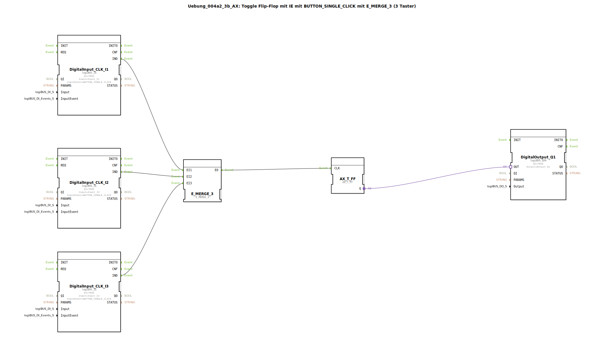

# Uebung_004a2_3b_AX: Toggle Flip-Flop mit IE mit BUTTON_SINGLE_CLICK mit E_MERGE_3 (3 Taster)

* * * * * * * * * *

## Einleitung

Diese Übung realisiert ein Toggle‑Flip‑Flop, das über drei Taster (BUTTON_SINGLE_CLICK) gesteuert wird. Die Ereignisse der Taster werden durch einen E_MERGE_3 zu einem einzigen Taktsignal zusammengeführt. Der Flip‑Flop wechselt bei jedem Tastendruck seinen Ausgangszustand und gibt das Ergebnis auf einen digitalen Ausgang aus.

## Verwendete Funktionsbausteine (FBs)

### Sub‑Baustein: DigitalInput_CLK_I1 (Typ: `logiBUS_IE`)
- **Typ**: `logiBUS::io::DI::logiBUS_IE`
- **Parameter**:
  - `QI` = `TRUE`
  - `Input` = `Input_I1`
  - `InputEvent` = `BUTTON_SINGLE_CLICK`
- **Funktionsweise**:  
  Digitaler Eingang, der bei einem einzelnen Tastendruck auf Kanal I1 ein Ereignis an seinem Ausgang `IND` auslöst.

### Sub‑Baustein: DigitalInput_CLK_I2 (Typ: `logiBUS_IE`)
- **Typ**: `logiBUS::io::DI::logiBUS_IE`
- **Parameter**:
  - `QI` = `TRUE`
  - `Input` = `Input_I2`
  - `InputEvent` = `BUTTON_SINGLE_CLICK`
- **Funktionsweise**:  
  Gleicher Baustein wie für Kanal I1, jedoch angeschlossen an den zweiten Taster (Input_I2).

### Sub‑Baustein: DigitalInput_CLK_I3 (Typ: `logiBUS_IE`)
- **Typ**: `logiBUS::io::DI::logiBUS_IE`
- **Parameter**:
  - `QI` = `TRUE`
  - `Input` = `Input_I3`
  - `InputEvent` = `BUTTON_SINGLE_CLICK`
- **Funktionsweise**:  
  Gleicher Baustein für den dritten Taster (Input_I3).

### Sub‑Baustein: E_MERGE_3 (Typ: `E_MERGE_3`)
- **Typ**: `iec61499::events::E_MERGE_3`
- **Parameter**: keine
- **Funktionsweise**:  
  Vereinigt drei Ereigniseingänge (`EI1`, `EI2`, `EI3`) zu einem einzigen Ereignisausgang (`EO`). Sobald ein Ereignis an einem der Eingänge eintrifft, wird es unverzögert an `EO` weitergegeben.

### Sub‑Baustein: AX_T_FF (Typ: `AX_T_FF`)
- **Typ**: `adapter::events::unidirectional::AX_T_FF`
- **Parameter**: keine
- **Funktionsweise**:  
  Toggle‑Flip‑Flop. Bei jedem Ereignis am Eingang `CLK` wechselt der Zustand am Ausgang `Q` zwischen `TRUE` und `FALSE` (toggle).

### Sub‑Baustein: DigitalOutput_Q1 (Typ: `logiBUS_QXA`)
- **Typ**: `logiBUS::io::DQ::logiBUS_QXA`
- **Parameter**:
  - `QI` = `TRUE`
  - `Output` = `Output_Q1`
- **Funktionsweise**:  
  Digitaler Ausgang. Der über den Adaptereingang `OUT` empfangene Wert wird auf den logiBUS-Kanal Q1 ausgegeben.

## Programmablauf und Verbindungen

Die drei Taster (I1, I2, I3) sind jeweils an einen `logiBUS_IE` angeschlossen, der bei jedem Tastendruck ein Ereignis (`BUTTON_SINGLE_CLICK`) erzeugt. Die Ereignisausgänge dieser drei Eingänge (`DigitalInput_CLK_I1.IND`, `DigitalInput_CLK_I2.IND`, `DigitalInput_CLK_I3.IND`) sind mit den drei Eingängen des `E_MERGE_3` (`EI1`, `EI2`, `EI3`) verbunden. Der Merge‑Baustein leitet jedes eingehende Ereignis an seinen Ausgang `EO` weiter. Dieser ist wiederum mit dem Takteingang `CLK` des Toggle‑Flip‑Flops `AX_T_FF` verbunden.  

Der Flip‑Flop wechselt bei jedem empfangenen Ereignis seinen Ausgangszustand. Der aktuelle Zustand wird über den Adapterausgang `Q` an den Adaptereingang `OUT` des Ausgangsbausteins `DigitalOutput_Q1` übergeben und erscheint auf dem digitalen Ausgang `Q1`.

Die gesamte Schaltung realisiert somit ein **Toggle‑Flip‑Flop mit drei Tastern**: Jeder Tastendruck – unabhängig von welchem Taster – toggelt den Ausgang.

### Lernziele
- Verständnis des Toggle‑Flip‑Flop‑Verhaltens
- Anwendung des Ereignis‑Merge‑Bausteins zur Bündelung mehrerer Ereignisquellen
- Einbindung von logiBUS‑Ein‑ und Ausgängen mit Ereignisauslösung
- Aufbau einer einfachen ereignisgesteuerten Schaltung in 4diac‑IDE

### Schwierigkeitsgrad  
Einfach – geeignet für Einsteiger in die IEC 61499‑Modellierung mit 4diac‑IDE.

### Benötigte Vorkenntnisse
- Grundlegendes Verständnis der IEC 61499‑Ereignis‑ und Datenflüsse
- Grundlagen der logiBUS‑Konfiguration (Ein‑/Ausgangskanäle)

## Zusammenfassung

Die Übung `Uebung_004a2_3b_AX` demonstriert den Aufbau eines Toggle‑Flip‑Flops, das über drei Taster gesteuert wird. Die Tasterereignisse werden mittels `E_MERGE_3` zu einem einzigen Taktsignal zusammengeführt und toggeln den Zustand eines Flip‑Flops, der über einen digitalen Ausgang ausgegeben wird. Dieses einfache Beispiel vermittelt grundlegende Konzepte der ereignisgesteuerten Programmierung mit Funktionsbausteinen unter Verwendung der logiBUS‑Hardware.