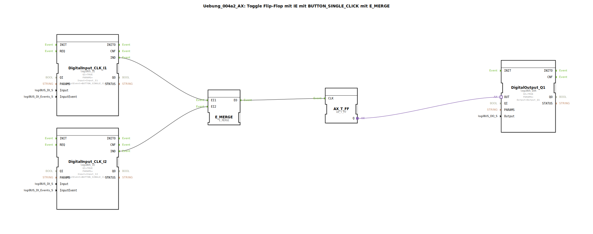

# Uebung_004a2_AX: Toggle Flip-Flop mit IE mit BUTTON_SINGLE_CLICK mit E_MERGE


[](https://notebooklm.google.com/notebook/041f4df4-b729-484d-b786-b6dcdf151961)

Dieser Artikel beschreibt die logiBUS®-Übung `Uebung_004a2_AX`. Hier wird die Stromstoßschaltung erweitert, sodass sie von zwei verschiedenen Tastern aus bedient werden kann. Dazu werden die Ereignisse der beiden Taster zusammengeführt.

----


## Ziel der Übung

Das Ziel ist es zu lernen, wie man asynchrone Ereignisströme vereint. Wenn zwei Ereignisquellen (Taster) denselben Prozess (Licht umschalten) auslösen sollen, müssen ihre Signale "gemerged" (zusammengeführt) werden, bevor sie den Funktionsbaustein erreichen.

-----

## Beschreibung und Komponenten

[cite_start]Die Subapplikation `Uebung_004a2_AX.SUB` nutzt einen `E_MERGE` Baustein, um zwei Eingangs-Events auf einen Flip-Flop-Eingang zu leiten[cite: 1].

### Funktionsbausteine (FBs)




  * **`DigitalInput_CLK_I1` & `I2`**: Zwei `logiBUS_IE` Bausteine, konfiguriert auf `BUTTON_SINGLE_CLICK`. [cite_start]Sie erzeugen Ereignisse bei Betätigung von Taster 1 oder 2[cite: 1].
  * **`E_MERGE`**: Typ `E_MERGE`. [cite_start]Dieser Baustein besitzt zwei Ereigniseingänge (`EI1`, `EI2`) und einen Ereignisausgang (`EO`). Egal welcher Eingang ein Event empfängt, es wird sofort an den Ausgang weitergeleitet[cite: 1].
  * **`E_T_FF`**: Das Toggle-Flip-Flop, das den Zustand speichert.
  * **`DigitalOutput_Q1`**: Der Ausgang für die Lampe.

-----

## Funktionsweise

```xml
<EventConnections>
    <Connection Source="DigitalInput_CLK_I1.IND" Destination="E_MERGE.EI1"/>
    <Connection Source="DigitalInput_CLK_I2.IND" Destination="E_MERGE.EI2"/>
    <Connection Source="E_MERGE.EO" Destination="E_T_FF.CLK"/>
</EventConnections>
```

[cite_start][cite: 1]

1.  Drückt man Taster 1, sendet `I1` ein Event an `E_MERGE.EI1`. `E_MERGE` leitet es an `EO` weiter -> `E_T_FF` schaltet um.
2.  Drückt man Taster 2, sendet `I2` ein Event an `E_MERGE.EI2`. `E_MERGE` leitet es an `EO` weiter -> `E_T_FF` schaltet um.

Somit kann das Licht von beiden Tastern aus beliebig ein- und ausgeschaltet werden.

-----

## Anwendungsbeispiel

Dies entspricht einer **Wechselschaltung im Flur**: Man kann das Licht unten einschalten und oben wieder ausschalten (und umgekehrt). Jeder Taster bewirkt lediglich eine Zustandsänderung ("Toggle"), egal wie der aktuelle Zustand ist.