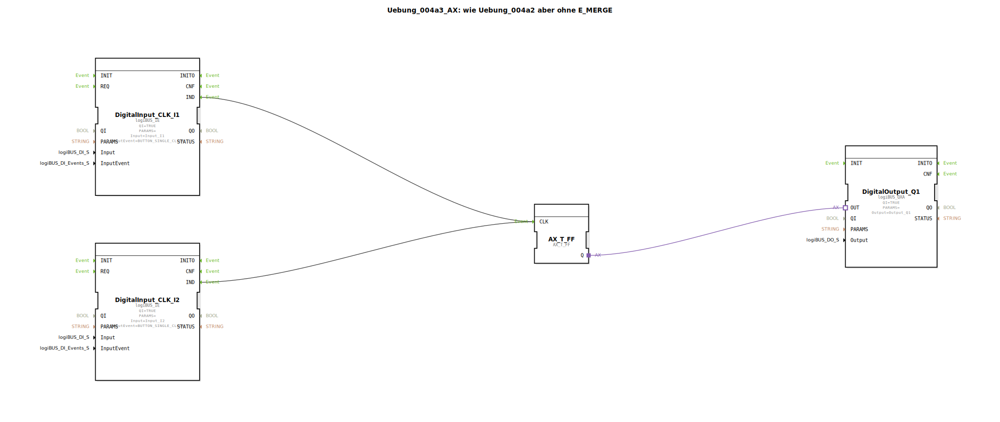

# Uebung_004a3_AX: wie Uebung_004a2 aber ohne E_MERGE


[](https://notebooklm.google.com/notebook/041f4df4-b729-484d-b786-b6dcdf151961)

Dieser Artikel beschreibt die logiBUS®-Übung `Uebung_004a3_AX`. Diese Übung zeigt eine Vereinfachung gegenüber `Uebung_004a2_AX`: In IEC 61499 (und speziell in 4diac) können mehrere Ereignisquellen oft direkt auf denselben Ereigniseingang verbunden werden.

----


## Ziel der Übung

Das Ziel ist die Reduktion der visuellen Komplexität. Es wird demonstriert, dass der explizite `E_MERGE` Baustein in vielen Fällen weggelassen werden kann, da die Laufzeitumgebung (Runtime) eingehende Events an einem Port automatisch nacheinander verarbeitet (implizites ODER für Events).

-----

## Beschreibung und Komponenten

[cite_start]Die Subapplikation `Uebung_004a3_AX.SUB` verbindet zwei Event-Quellen direkt mit dem Takteingang des Flip-Flops[cite: 1].

### Funktionsbausteine (FBs)




  * **`DigitalInput_CLK_I1` & `I2`**: Die Event-Generatoren.
  * **`E_T_FF`**: Das Toggle-Flip-Flop.
  * **`DigitalOutput_Q1`**: Der Ausgang.

Der Baustein `E_MERGE` fehlt hier bewusst.

-----

## Funktionsweise

```xml
<EventConnections>
    <Connection Source="DigitalInput_CLK_I1.IND" Destination="E_T_FF.CLK"/>
    <Connection Source="DigitalInput_CLK_I2.IND" Destination="E_T_FF.CLK"/>
</EventConnections>
```

[cite_start][cite: 1]

Die Funktionsweise ist identisch zur Übung mit `E_MERGE`:
Jedes eintreffende Event an `E_T_FF.CLK` – egal ob von `I1` oder `I2` kommend – triggert die Ausführung des Funktionsbausteins. Die 4diac IDE und Runtime unterstützen diese "Fan-In"-Verbindungen für Events.

*(Hinweis: Bei Datenverbindungen ist dies **nicht** erlaubt! Zwei Datenausgänge dürfen niemals direkt auf denselben Dateneingang schreiben, da dies zu Konflikten führen würde. Bei Events ist es jedoch eine gängige Praxis für "ODER"-Verknüpfungen von Auslösern.)*

-----

## Anwendungsbeispiel

Gleiches Beispiel wie zuvor (Wechselschaltung), jedoch mit effizienterem Code (weniger Bausteine, weniger Speicherbedarf).