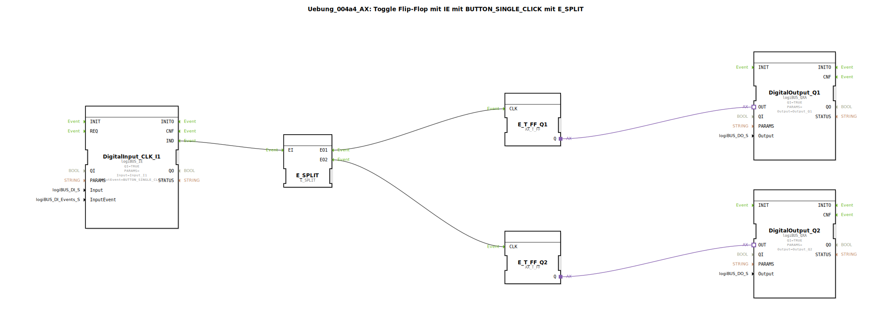

# Uebung_004a4_AX: Toggle Flip-Flop mit IE mit BUTTON_SINGLE_CLICK mit E_SPLIT


[](https://notebooklm.google.com/notebook/041f4df4-b729-484d-b786-b6dcdf151961)

Dieser Artikel beschreibt die logiBUS®-Übung `Uebung_004a4_AX`. Hier wird gezeigt, wie ein einzelnes Ereignis genutzt werden kann, um mehrere unabhängige Prozesse anzustoßen, indem man einen `E_SPLIT` Baustein verwendet.

----


## Ziel der Übung

Das Ziel ist das Verständnis der sequenziellen Event-Verarbeitung. In IEC 61499 kann ein Event-Ausgang oft nur mit einem Event-Eingang verbunden sein (Fan-Out = 1), oder man möchte explizit die Reihenfolge der Abarbeitung steuern. Der `E_SPLIT` Baustein nimmt ein Eingangs-Event und feuert nacheinander Ausgänge ab.

-----

## Beschreibung und Komponenten

[cite_start]Die Subapplikation `Uebung_004a4_AX.SUB` verwendet einen Taster, um zwei separate Toggle-Flip-Flops zu schalten[cite: 1].

### Funktionsbausteine (FBs)




  * **`DigitalInput_CLK_I1`**: Der Event-Generator (Taster).
  * **`E_SPLIT`**: Ein Event-Verteiler. Er hat einen Eingang `EI` und zwei Ausgänge `EO1` und `EO2`.
  * **`E_T_FF_Q1` & `Q2`**: Zwei unabhängige Flip-Flops.
  * **`DigitalOutput_Q1` & `Q2`**: Zwei Lampen.

-----

## Funktionsweise

```xml
<EventConnections>
    <Connection Source="DigitalInput_CLK_I1.IND" Destination="E_SPLIT.EI"/>
    <Connection Source="E_SPLIT.EO1" Destination="E_T_FF_Q1.CLK"/>
    <Connection Source="E_SPLIT.EO2" Destination="E_T_FF_Q2.CLK"/>
</EventConnections>
```

[cite_start][cite: 1]

1.  Ein Klick auf Taster 1 sendet ein Event an `E_SPLIT`.
2.  `E_SPLIT` sendet **zuerst** ein Event an `EO1` -> `E_T_FF_Q1` schaltet um.
3.  Danach (quasi zeitgleich, aber logisch danach) sendet `E_SPLIT` ein Event an `EO2` -> `E_T_FF_Q2` schaltet um.

Beide Lampen schalten somit synchron um, gesteuert durch einen Taster.

*(Hinweis im Code: "hier 2x T_FF zu verwenden ist sinnlos, das soll nur zeigen wie man E_SPLIT verwenden kann." - Das stimmt, man hätte auch beide Ausgänge an ein FF hängen können. Hier geht es rein um die Demonstration des Event-Splittings.)*

-----

## Anwendungsbeispiel

**Szenen-Steuerung**: Ein Taster "Feierabend" betätigt gleichzeitig (bzw. nacheinander) mehrere Aktionen: Licht ausschalten (`Q1`) und Alarmanlage scharfschalten (`Q2`). Durch den Splitter wird sichergestellt, dass beide Funktionsketten angestoßen werden.