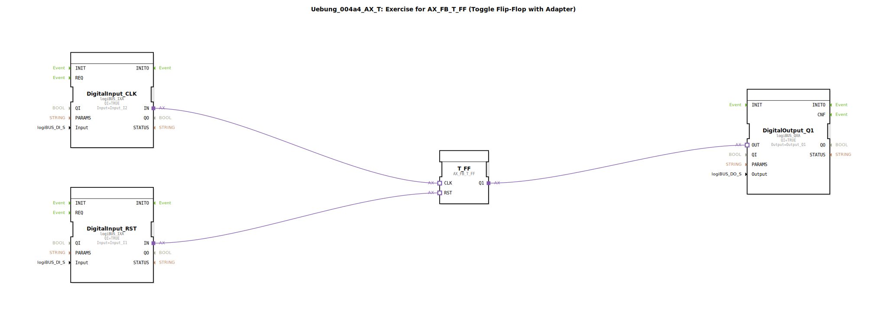

# Uebung_004a4_AX_T: Exercise for AX_FB_T_FF (Toggle Flip-Flop with Adapter)

* * * * * * * * * *
## Einleitung
Diese Übung demonstriert die Verwendung eines **Toggle-Flipflops (AX_FB_T_FF)** mit Hilfe von Adaptern.  
Ein Toggle-Flipflop ändert bei jedem positiven Taktimpuls (CLK) seinen Ausgangszustand (Q1) und kann über den Rücksetzeingang (RST) auf `FALSE` gesetzt werden.

Die Eingänge werden über zwei logiBUS-Digital-Eingabebausteine (Input_I1 und Input_I2) realisiert, der Ausgang über einen logiBUS-Digital-Ausgabebaustein (Output_Q1).

## Verwendete Funktionsbausteine (FBs)
Die SubApp enthält folgende Funktionsbausteine:

- **DigitalInput_RST**  
  - Typ: `logiBUS::io::DI::logiBUS_IXA`  
  - Parameter: `QI = TRUE`, `Input = Input_I1`  
  - *Verbindet den physischen Eingang Input_I1 mit dem RST-Signal des Flipflops.*

- **DigitalInput_CLK**  
  - Typ: `logiBUS::io::DI::logiBUS_IXA`  
  - Parameter: `QI = TRUE`, `Input = Input_I2`  
  - *Verbindet den physischen Eingang Input_I2 mit dem Taktsignal (CLK) des Flipflops.*

- **T_FF**  
  - Typ: `adapter::bistableElements::AX_FB_T_FF`  
  - Keine weiteren Parameter.  
  - *Kern der Übung: Ein Toggle-Flipflop, das bei jedem Takt den Ausgang umschaltet.*

- **DigitalOutput_Q1**  
  - Typ: `logiBUS::io::DQ::logiBUS_QXA`  
  - Parameter: `QI = TRUE`, `Output = Output_Q1`  
  - *Verbindet den Flipflop-Ausgang mit dem physischen Ausgang Output_Q1.*

### Sub-Bausteine:
Es wurden keine weiteren SubApp-Bausteine innerhalb dieser Übung verwendet.

## Programmablauf und Verbindungen
Die Funktionsbausteine sind über **Adapterverbindungen** (keine klassischen Event-/Datenverbindungen) verknüpft:

1. **Reset-Signal (RST):**  
   `DigitalInput_RST.IN` → `T_FF.RST`  
   *Ein Signal auf Eingang Input_I1 setzt das Flipflop zurück (Q1 = FALSE).*

2. **Taktsignal (CLK):**  
   `DigitalInput_CLK.IN` → `T_FF.CLK`  
   *Jede steigende Flanke auf Input_I2 schaltet den Ausgang Q1 um (von TRUE nach FALSE oder umgekehrt).*

3. **Ausgang (Q1):**  
   `T_FF.Q1` → `DigitalOutput_Q1.OUT`  
   *Der aktuelle Zustand des Flipflops wird auf den physischen Ausgang Output_Q1 ausgegeben.*

**Ablauf:**  
- Solange kein Reset anliegt, wechselt der Ausgang bei jedem Taktimpuls seinen Zustand.  
- Ein aktiver Reset (TRue) setzt den Ausgang sofort auf `FALSE` und hält ihn dort, bis der Reset wieder wegfällt und ein neuer Takt kommt.

## Zusammenfassung
Mit dieser Übung wird die Anwendung eines **Toggle-Flipflops** über Adapterverbindungen in der 4diac-IDE vermittelt.  
- Lernziele:  
  - Verstehen der Arbeitsweise eines Toggle-Flipflops (AX_FB_T_FF).  
  - Anbinden von physikalischen Ein-/Ausgängen über logiBUS-Adapter.  
  - Erstellen und Testen einer einfachen Schaltung zur Zustandsänderung per Takt.  

- Benötigte Vorkenntnisse: Grundlagen der IEC 61499, Verwendung von Adaptern, logiBUS-Einbindung.  

Die Übung eignet sich zum Einstieg in die sequentielle Logik mit Speicherverhalten.