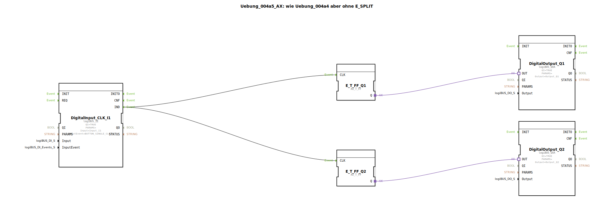

# Uebung_004a5_AX: wie Uebung_004a4 aber ohne E_SPLIT


[](https://notebooklm.google.com/notebook/041f4df4-b729-484d-b786-b6dcdf151961)

Dieser Artikel beschreibt die logiBUS®-Übung `Uebung_004a5_AX`. Ähnlich wie bei `Uebung_004a3_AX` (Impliziter Merge) wird hier gezeigt, dass auch ein Event-Split oft ohne expliziten Baustein möglich ist.

----


## Ziel der Übung

Demonstration der "Fan-Out"-Fähigkeit von Ereignisverbindungen in 4diac. Ein Quell-Event kann mit mehreren Ziel-Events verbunden werden.

-----

## Beschreibung und Komponenten

[cite_start]Die Subapplikation `Uebung_004a5_AX.SUB` entfernt den `E_SPLIT` Baustein aus der vorherigen Übung und verbindet den Taster direkt mit beiden Flip-Flops[cite: 1].

### Funktionsbausteine (FBs)




  * **`DigitalInput_CLK_I1`**: Taster.
  * **`E_T_FF_Q1` & `Q2`**: Flip-Flops.

-----

## Funktionsweise

```xml
<EventConnections>
    <Connection Source="DigitalInput_CLK_I1.IND" Destination="E_T_FF_Q1.CLK"/>
    <Connection Source="DigitalInput_CLK_I1.IND" Destination="E_T_FF_Q2.CLK"/>
</EventConnections>
```

[cite_start][cite: 1]

Wenn `I1` ein Event feuert, wird dieses an alle verbundenen Ziele verteilt. Die Reihenfolge der Abarbeitung ist in der IEC 61499 Norm nicht strikt für "Fan-Out" definiert (es ist implementationsabhängig, meistens in der Reihenfolge der Erstellung der Verbindung). Wenn die Reihenfolge kritisch ist, **muss** ein `E_SPLIT` verwendet werden. Wenn es egal ist (wie hier, wo nur zwei Lampen toggeln sollen), reicht die direkte Verbindung.

-----

## Anwendungsbeispiel

Gleiches Beispiel wie zuvor (Zentral-Aus), aber platzsparender implementiert.