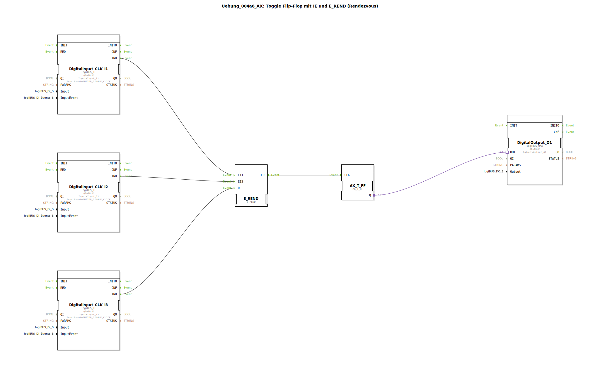

# Uebung_004a6_AX: Toggle Flip-Flop mit IE und E_REND (Rendezvous)


[](https://notebooklm.google.com/notebook/041f4df4-b729-484d-b786-b6dcdf151961)

Dieser Artikel beschreibt die logiBUS®-Übung `Uebung_004a6_AX`. Hier wird ein komplexeres Event-Handling-Muster vorgestellt: Das Rendezvous. Ein Ereignis wird erst dann weitergegeben, wenn zwei Bedingungen (Events) eingetreten sind.

----


## Ziel der Übung




Verständnis des `E_REND` Bausteins. Dieser Baustein fungiert wie ein "UND" für Ereignisse. Er merkt sich, welche Eingänge bereits gefeuert haben, und feuert erst am Ausgang, wenn *alle* erforderlichen Eingänge mindestens einmal aktiv waren. Danach setzt er sich zurück.

-----

## Beschreibung und Komponenten

[cite_start]Die Subapplikation `Uebung_004a6_AX.SUB` nutzt `E_REND`, um sicherzustellen, dass zwei Taster gedrückt wurden, bevor das Licht umschaltet[cite: 1].

### Funktionsbausteine (FBs)

  * **`DigitalInput_CLK_I1` & `I2`**: Die beiden Bestätigungs-Taster.
  * **`DigitalInput_CLK_I3`**: Ein Reset-Taster.
  * **`E_REND`**: Der Rendezvous-Baustein mit Eingängen `EI1`, `EI2` und einem Reset `R`.
  * **`E_T_FF`**: Das Flip-Flop.
  * **`DigitalOutput_Q1`**: Die Lampe.

-----

## Funktionsweise

```xml
<EventConnections>
    <Connection Source="DigitalInput_CLK_I1.IND" Destination="E_REND.EI1"/>
    <Connection Source="DigitalInput_CLK_I2.IND" Destination="E_REND.EI2"/>
    <Connection Source="E_REND.EO" Destination="E_T_FF.CLK"/>
    <Connection Source="DigitalInput_CLK_I3.IND" Destination="E_REND.R"/>
</EventConnections>
```

[cite_start][cite: 1]

1.  Drückt man nur Taster 1 (`I1`), passiert nichts am Ausgang. `E_REND` merkt sich intern "EI1 war da".
2.  Drückt man danach Taster 2 (`I2`), ist die Bedingung komplett (beide waren da). `E_REND` feuert `EO`.
3.  Das Flip-Flop schaltet um, die Lampe ändert ihren Zustand.
4.  `E_REND` vergisst den Status und wartet erneut auf beide Events.

*   Der Reset-Taster (`I3`) kann genutzt werden, um den internen Merker des `E_REND` zu löschen, falls man z.B. nur Taster 1 gedrückt hat und den Vorgang abbrechen will.

-----

## Anwendungsbeispiel

**Zweihand-Auslösung (Sequenziell)**: Ein Prozess soll erst starten, wenn Bediener A "Freigabe" drückt UND Bediener B "Start" drückt (Reihenfolge egal, aber beide müssen einmal gedrückt haben).