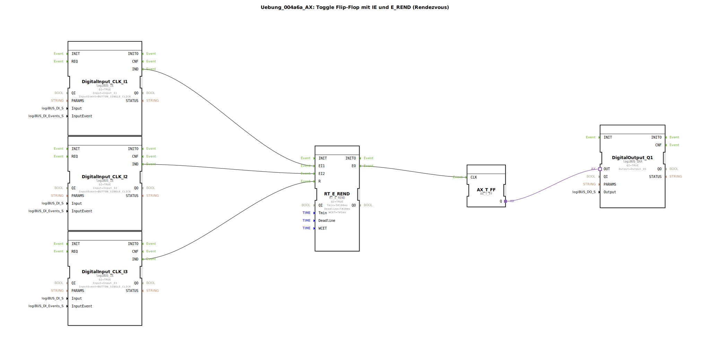

# Uebung_004a6a_AX: Toggle Flip-Flop mit IE und E_REND (Rendezvous)

* * * * * * * * * *
## Einleitung
Diese Übung realisiert einen **Toggle-Flip-Flop** (Wechselschalter) unter Verwendung von **Ereignis-Eingängen** (IE) und einem **Rendezvous-Baustein** (`RT_E_REND`).  
Das System erwartet zwei Tasterereignisse (Eingänge I1 und I2), die innerhalb einer bestimmten Zeitschranke (Deadline) eintreffen müssen. Erst wenn beide Ereignisse synchronisiert wurden, wird der Flip-Flop getaktet und der Digitalausgang Q1 umgeschaltet. Ein dritter Taster (I3) dient als Reset für den Rendezvous-Mechanismus.  
Die Übung demonstriert den Umgang mit zeitkritischen Ereignisverbindungen, Rendezvous-Synchronisation und einfachen Toggle-Funktionen in der 4diac-IDE.

## Verwendete Funktionsbausteine (FBs)
Die SubApp verwendet folgende (Sub-)Bausteine:

- **`DigitalInput_CLK_I1`** – Typ: `logiBUS::io::DI::logiBUS_IE`  
  - **Parameter:**  
    - `QI` = `TRUE`  
    - `Input` = `Input_I1`  
    - `InputEvent` = `BUTTON_SINGLE_CLICK`  
  - **Ereignisausgang:** `IND` (sendet Ereignis bei Tastendruck)  
  - **Funktion:** Erzeugt ein Ereignis, sobald der Taster an Eingang I1 einmal gedrückt wird.

- **`DigitalInput_CLK_I2`** – Typ: `logiBUS::io::DI::logiBUS_IE`  
  - **Parameter:**  
    - `QI` = `TRUE`  
    - `Input` = `Input_I2`  
    - `InputEvent` = `BUTTON_SINGLE_CLICK`  
  - **Ereignisausgang:** `IND`  
  - **Funktion:** Erzeugt ein Ereignis bei Tastendruck an Eingang I2.

- **`DigitalInput_CLK_I3`** – Typ: `logiBUS::io::DI::logiBUS_IE`  
  - **Parameter:**  
    - `QI` = `TRUE`  
    - `Input` = `Input_I3`  
    - `InputEvent` = `BUTTON_SINGLE_CLICK`  
  - **Ereignisausgang:** `IND`  
  - **Funktion:** Erzeugt ein Ereignis bei Tastendruck an Eingang I3 (dient als Reset).

- **`RT_E_REND`** – Typ: `eclipse4diac::rtevents::RT_E_REND`  
  - **Parameter:**  
    - `QI` = `TRUE`  
    - `Tmin` = `T#100ms` (minimale Ereigniszeit, hier nicht ausgenutzt)  
    - `Deadline` = `T#20ms` (maximale Zeit zwischen EI1 und EI2)  
    - `WCET` = `T#1ms` (worst-case execution time)  
  - **Ereigniseingänge:** `EI1`, `EI2`, `R` (Reset)  
  - **Ereignisausgang:** `EO`  
  - **Datenverbindungen:** keine  
  - **Funktion:** Führt ein Rendezvous zwischen den Ereignissen an `EI1` und `EI2` durch. Wenn beide innerhalb der `Deadline` eintreffen, wird `EO` ausgelöst. Der Eingang `R` setzt den internen Zustand zurück.

- **`AX_T_FF`** – Typ: `adapter::events::unidirectional::AX_T_FF`  
  - **Parameter:** keine  
  - **Ereigniseingang:** `CLK` (Taktsignal)  
  - **Adapterausgang:** `Q`  
  - **Funktion:** Toggle-Flip-Flop. Jedes Ereignis am `CLK`-Eingang wechselt den Zustand des Ausgangs `Q`.  

- **`DigitalOutput_Q1`** – Typ: `logiBUS::io::DQ::logiBUS_QXA`  
  - **Parameter:**  
    - `QI` = `TRUE`  
    - `Output` = `Output_Q1`  
  - **Adaptereingang:** `OUT` (Steuersignal)  
  - **Funktion:** Gibt den Wert von `OUT` auf dem physischen Ausgang Q1 aus.

## Programmablauf und Verbindungen

1. **Ereigniserfassung:**  
   - Die drei Tastereingänge (`Input_I1`, `Input_I2`, `Input_I3`) werden durch die `DigitalInput_CLK_IX`-Bausteine überwacht. Bei jedem einfachen Tastendruck (Ereignis `BUTTON_SINGLE_CLICK`) wird der Ereignisausgang `IND` aktiviert.

2. **Rendezvous (Ereignissynchronisation):**  
   - Die Ereignisse von `I1` und `I2` werden an `EI1` und `EI2` des `RT_E_REND`-Bausteins weitergeleitet.  
   - Solange nicht beide Ereignisse eingetroffen sind, wartet der Baustein. Die maximale Wartezeit zwischen dem ersten und zweiten Ereignis beträgt 20 ms (`Deadline`). Überschreitet die Differenz diesen Wert, wird der Vorgang verworfen und der nächste Versuch wird erwartet.  
   - Ein Ereignis von `I3` (Reset-Pin) setzt den Rendezvous-Zustand sofort zurück, ohne `EO` auszulösen.

3. **Toggle-Flip-Flop:**  
   - Wenn der Rendezvous erfolgreich ist, sendet `RT_E_REND` ein Ereignis an den `CLK`-Eingang des `AX_T_FF`.  
   - Der Flip-Flop wechselt seinen internen Zustand (von `FALSE` auf `TRUE` oder umgekehrt) und gibt diesen über den Adapterausgang `Q` aus.

4. **Ausgabe:**  
   - Der Zustand des Flip-Flops (`Q`) wird an den `OUT`-Adaptereingang des `DigitalOutput_Q1`-Bausteins angeschlossen. Dieser steuert den physischen Ausgang `Output_Q1` entsprechend.  
   - Bei jedem erfolgreichen Rendezvous schaltet die Ausgabe also um (Toggle-Funktion).

**Zusammenfassende Verbindungstabelle:**  
| Quelle | Ziel |
|--------|------|
| `DigitalInput_CLK_I1.IND` | `RT_E_REND.EI1` |
| `DigitalInput_CLK_I2.IND` | `RT_E_REND.EI2` |
| `DigitalInput_CLK_I3.IND` | `RT_E_REND.R` |
| `RT_E_REND.EO` | `AX_T_FF.CLK` |
| `AX_T_FF.Q` (Adapter) | `DigitalOutput_Q1.OUT` (Adapter) |

## Zusammenfassung
Die Übung zeigt:  
- Die Verwendung von **Ereignis-Eingängen** (`logiBUS_IE`) zur Erfassung von Tasterdrücken.  
- Die **zeitgesteuerte Rendezvous-Synchronisation** (`RT_E_REND`) mit konfigurierbarer Deadline.  
- Den Betrieb eines **Toggle-Flip-Flops** (`AX_T_FF`), der durch das Rendezvous-Ereignis getaktet wird.  
- Die Anbindung eines **Digitalausgangs** (`logiBUS_QXA`) zur Ausgabe des Flip-Flop-Zustands.  

Damit wird die Grundlage für zeitkritische, ereignisgesteuerte Logik in der Automatisierungstechnik vermittelt.