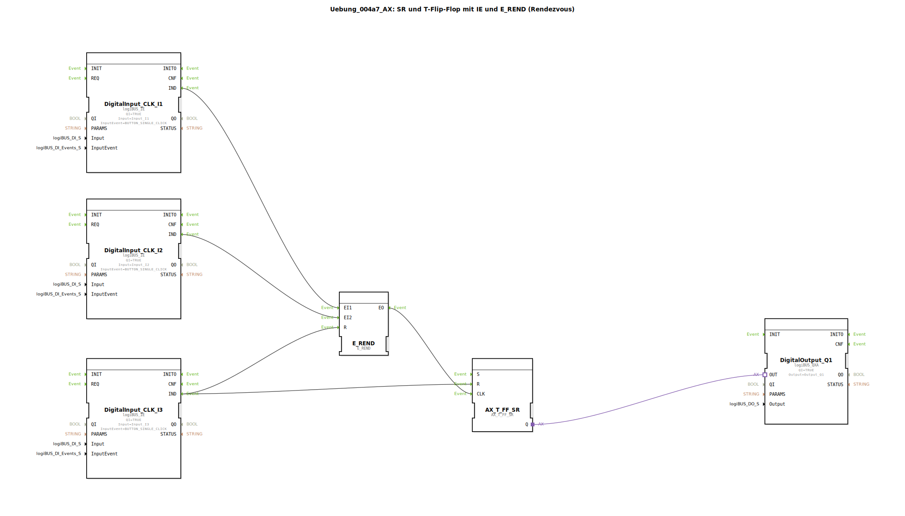

# Uebung_004a7_AX: SR und T-Flip-Flop mit IE und E_REND (Rendezvous)


[](https://notebooklm.google.com/notebook/041f4df4-b729-484d-b786-b6dcdf151961)

Dieser Artikel beschreibt die logiBUS®-Übung `Uebung_004a7_AX`. Sie kombiniert das Rendezvous-Muster mit einem erweiterten Flip-Flop-Typ, der Set- und Reset-Funktionalität bietet.

----


## Ziel der Übung

Demonstration der Interaktion zwischen Ereignis-Logik (`E_REND`) und Zustands-Logik (`AX_T_FF_SR` - Toggle Flip-Flop mit Set/Reset).

-----

## Beschreibung und Komponenten

[cite_start]Die Subapplikation `Uebung_004a7_AX.SUB` verwendet zwei Taster zum "Scharfschalten" (Rendezvous) und einen dritten zum expliziten Rücksetzen[cite: 1].

### Funktionsbausteine (FBs)




  * **`I1` & `I2`**: Eingänge für das Rendezvous.
  * **`I3`**: Reset-Eingang.
  * **`E_REND`**: Synchronisiert `I1` und `I2`.
  * **`AX_T_FF_SR`**: Ein Toggle-Flip-Flop, das zusätzlich einen `R` (Reset) Eingang hat, um den Ausgang definiert auf FALSE zu setzen.

-----

## Funktionsweise

```xml
<EventConnections>
    <Connection Source="DigitalInput_CLK_I1.IND" Destination="E_REND.EI1"/>
    <Connection Source="DigitalInput_CLK_I2.IND" Destination="E_REND.EI2"/>
    <Connection Source="E_REND.EO" Destination="AX_T_FF_SR.CLK"/>
    <Connection Source="DigitalInput_CLK_I3.IND" Destination="AX_T_FF_SR.R"/>
    <Connection Source="DigitalInput_CLK_I3.IND" Destination="E_REND.R"/>
</EventConnections>
```

[cite_start][cite: 1]

1.  Um die Lampe (`Q1`) einzuschalten (oder umzuschalten), müssen `I1` und `I2` gedrückt werden (Rendezvous -> `CLK`).
2.  Der Taster `I3` ist der "Not-Aus" oder "Alles Löschen". Er ist verbunden mit:
    *   `E_REND.R`: Löscht eventuell halb-fertige Rendezvous-Zustände.
    *   `AX_T_FF_SR.R`: Setzt das Flip-Flop hart auf FALSE zurück (Lampe aus).

-----

## Anwendungsbeispiel

**Maschinenstart mit Reset**: Zwei Sicherheitszonen müssen als "frei" gemeldet werden (`I1`, `I2`), bevor die Maschine starten kann (`CLK`). Ein Not-Halt-Taster (`I3`) stoppt die Maschine sofort und löscht alle Freigaben.