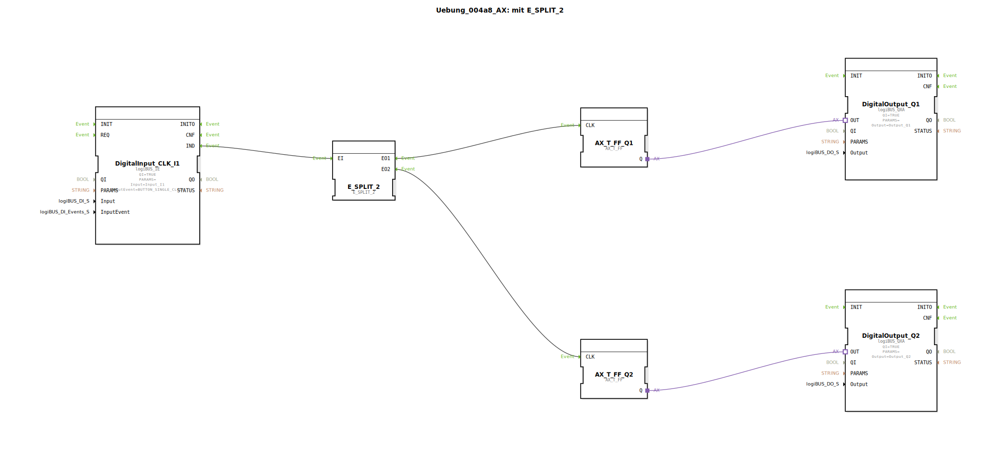

# Uebung_004a8_AX: mit E_SPLIT_2


[](https://notebooklm.google.com/notebook/041f4df4-b729-484d-b786-b6dcdf151961)

Dieser Artikel beschreibt die logiBUS®-Übung `Uebung_004a8_AX`. Dies ist eine Variante von `Uebung_004a4_AX`, bei der ein spezifischer `E_SPLIT_2` Baustein verwendet wird, der explizit für 2 Ausgänge gedacht ist.

----


## Ziel der Übung

Kennenlernen der spezifischen Splitter-Bausteine. `E_SPLIT` ist oft der generische Name, aber in vielen Bibliotheken gibt es spezifische Versionen wie `E_SPLIT_2`, `E_SPLIT_3` etc., um die Anzahl der Ausgänge festzulegen.

-----

## Beschreibung und Komponenten

[cite_start]Die Subapplikation `Uebung_004a8_AX.SUB` nutzt `E_SPLIT_2`, um einen Tasterklick auf zwei unabhängige Flip-Flops zu verteilen[cite: 1].

### Funktionsbausteine (FBs)




  * **`DigitalInput_CLK_I1`**: Taster.
  * **`E_SPLIT_2`**: Verteilt Eingang `EI` sequenziell auf `EO1` und `EO2`.
  * **`AX_T_FF_Q1` & `Q2`**: Zwei Flip-Flops für die Ausgänge `Q1` und `Q2`.

-----

## Funktionsweise

```xml
<EventConnections>
    <Connection Source="DigitalInput_CLK_I1.IND" Destination="E_SPLIT_2.EI"/>
    <Connection Source="E_SPLIT_2.EO1" Destination="AX_T_FF_Q1.CLK"/>
    <Connection Source="E_SPLIT_2.EO2" Destination="AX_T_FF_Q2.CLK"/>
</EventConnections>
```

[cite_start][cite: 1]

Funktional identisch zu `Uebung_004a4_AX`: Ein Eingangsevent löst nacheinander zwei Ausgangsevents aus, wodurch beide Flip-Flops sicher und definiert angesteuert werden.

-----

## Anwendungsbeispiel

Synchrones Schalten von redundanten Systemen, bei denen sichergestellt sein muss, dass beide Systeme den Schaltbefehl erhalten.