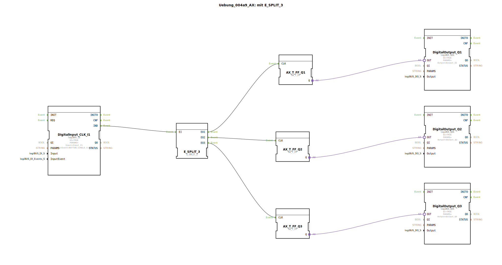

# Uebung_004a9_AX: mit E_SPLIT_3


[](https://notebooklm.google.com/notebook/041f4df4-b729-484d-b786-b6dcdf151961)

Dieser Artikel beschreibt die logiBUS®-Übung `Uebung_004a9_AX`. Hier wird das Konzept des Event-Splittings auf drei Ziele erweitert.

----


## Ziel der Übung

Demonstration der Skalierbarkeit von Event-Verteilern. Mit `E_SPLIT_3` können drei Prozesse sequenziell angestoßen werden.

-----

## Beschreibung und Komponenten

[cite_start]Die Subapplikation `Uebung_004a9_AX.SUB` verteilt das Signal eines Tasters auf drei separate Toggle-Flip-Flops und somit auf drei Ausgänge[cite: 1].

### Funktionsbausteine (FBs)




  * **`DigitalInput_CLK_I1`**: Taster.
  * **`E_SPLIT_3`**: Verteilt Eingang `EI` sequenziell auf `EO1`, `EO2` und `EO3`.
  * **`AX_T_FF_Q1`, `Q2`, `Q3`**: Drei Flip-Flops.
  * **`DigitalOutput_Q1`, `Q2`, `Q3`**: Drei Lampen.

-----

## Funktionsweise

```xml
<EventConnections>
    <Connection Source="DigitalInput_CLK_I1.IND" Destination="E_SPLIT_3.EI"/>
    <Connection Source="E_SPLIT_3.EO1" Destination="AX_T_FF_Q1.CLK"/>
    <Connection Source="E_SPLIT_3.EO2" Destination="AX_T_FF_Q2.CLK"/>
    <Connection Source="E_SPLIT_3.EO3" Destination="AX_T_FF_Q3.CLK"/>
</EventConnections>
```

[cite_start][cite: 1]

Ein einzelner Klick auf den Taster löst eine Kaskade aus:
1.  `EO1` feuert -> `Q1` toggelt.
2.  `EO2` feuert -> `Q2` toggelt.
3.  `EO3` feuert -> `Q3` toggelt.

Dies geschieht in der SPS-Zykluszeit so schnell, dass es für das menschliche Auge simultan wirkt, aber steuerungstechnisch ist es eine definierte Sequenz.

-----

## Anwendungsbeispiel

**Zentral-Schalter für eine Etage**: Ein Taster an der Wohnungstür schaltet Licht im Flur (`Q1`), Küche (`Q2`) und Wohnzimmer (`Q3`) gleichzeitig aus (oder um).