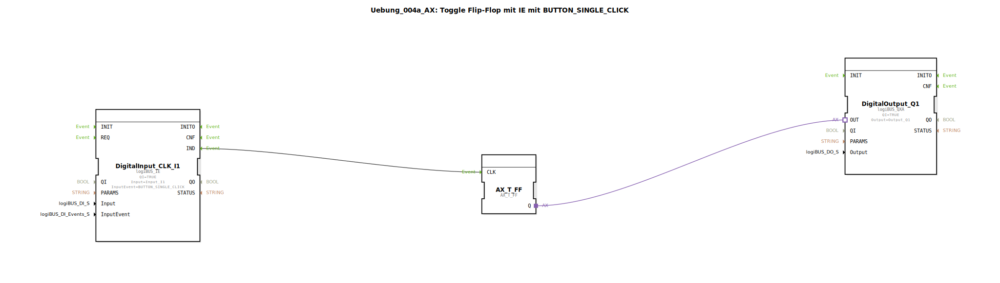

# Uebung_004a_AX: Toggle Flip-Flop mit IE mit BUTTON_SINGLE_CLICK

Dieser Artikel beschreibt die logiBUS®-Übung `Uebung_004a_AX`. In dieser Übung verlassen wir die reine Datenweiterleitung und nutzen Ereignisse (Events), um eine Speicherfunktion zu realisieren: einen klassischen Stromstoßschalter.

----

## Ziel der Übung

Das Ziel ist es, den Unterschied zwischen zustandsorientierter (Pegel) und ereignisorientierter (Flanke) Programmierung zu verstehen. Während ein einfacher Taster nur solange "Ein" ist, wie er gedrückt wird, soll hier jeder Tastendruck den Zustand des Ausgangs wechseln (Umschalten: Aus -> Ein -> Aus -> ...).

-----

## Beschreibung und Komponenten

[cite_start]Die Subapplikation `Uebung_004a_AX.SUB` verwendet einen speziellen Eingangsbaustein, der Klick-Ereignisse generiert, und ein Toggle-Flip-Flop[cite: 1].

### Funktionsbausteine (FBs)

  * **`DigitalInput_CLK_I1`**: Typ `logiBUS_IE` (Input Event). [cite_start]Im Gegensatz zum `IXA` (Input Extended Adapter) liefert dieser Baustein kein kontinuierliches `BOOL`-Signal, sondern feuert ein einzelnes Ereignis (`IND`), wenn eine bestimmte Bedingung erfüllt ist. Hier ist er auf `BUTTON_SINGLE_CLICK` konfiguriert[cite: 1].
  * **`E_T_FF`**: Typ `AX_T_FF` (Adapter Toggle Flip-Flop). [cite_start]Dieser Baustein hat einen Takteingang (`CLK`). Bei jedem empfangenen Ereignis wechselt er seinen internen Zustand und gibt diesen über den Adapter-Ausgang `Q` aus[cite: 1].
  * **`DigitalOutput_Q1`**: Typ `logiBUS_QXA`. [cite_start]Schaltet den physischen Ausgang `Q1` basierend auf dem Zustand des Flip-Flops[cite: 1].

-----

## Funktionsweise

1.  Der Benutzer drückt den Taster an `I1` kurz ("Klick").
2.  Der `DigitalInput_CLK_I1` erkennt das Muster "Einzelklick" und sendet ein `IND`-Ereignis.
3.  Das Ereignis erreicht den `CLK`-Eingang des `E_T_FF`.
4.  Das Flip-Flop kippt seinen Zustand (z.B. von FALSE auf TRUE).
5.  Der neue Zustand wird über den Adapter-Ausgang `Q` an `DigitalOutput_Q1` gesendet.
6.  Die Lampe an `Q1` geht an und bleibt an, auch wenn der Taster losgelassen wird.
7.  Beim nächsten Klick wiederholt sich der Vorgang, das Flip-Flop kippt zurück auf FALSE, die Lampe geht aus.

-----

## Anwendungsbeispiel

Die klassische **Flurbeleuchtung** oder **Treppenhauslicht** (ohne Zeitglied): Ein Tasterdruck schaltet das Licht ein, der nächste schaltet es wieder aus. Dies ist mit einem rein elektrischen Schalter (der zurückfedert) nicht möglich, man benötigt ein Speicherelement (Stromstoßrelais in der Elektrotechnik, Flip-Flop in der Software).