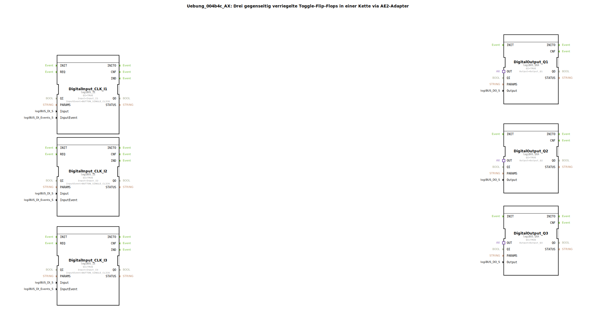

# Uebung_004b4c_AX: Drei gegenseitig verriegelte Toggle-Flip-Flops in einer Kette via AE2-Adapter

* * * * * * * * * *
## Einleitung
Diese Übung befasst sich mit der Realisierung einer Kette aus drei gegenseitig verriegelten Toggle-Flip-Flops. Die Verriegelung erfolgt über AE2-Adapter (bidirektionale Schnittstellen), sodass jeder Sub-Baustein seinen Zustand nur dann wechseln kann, wenn die vorgängigen Flip-Flops inaktiv sind. Dadurch wird sichergestellt, dass zu jedem Zeitpunkt nur ein Ausgang aktiv sein kann. Die Eingänge werden über logiBUS-Taster (Single-Click-Ereignis) angesteuert, die Ausgänge über logiBUS-LEDs ausgegeben.

## Verwendete Funktionsbausteine (FBs)
Die folgende Tabelle listet die im Netzwerk verwendeten Bausteine auf:

| Bausteinname                     | Typ               | Beschreibung |
|----------------------------------|-------------------|--------------|
| `DigitalInput_CLK_I1`, `I2`, `I3` | `logiBUS_IE`      | Digitaleingang für Taster (Single-Click) an den physikalischen Eingängen `Input_I1`, `Input_I2`, `Input_I3`. |
| `DigitalOutput_Q1`, `Q2`, `Q3`   | `logiBUS_QXA`     | Digitalausgang zur Ansteuerung der physikalischen Ausgänge `Output_Q1`, `Output_Q2`, `Output_Q3`. |
| `Uebung_004b4c_sub_AX1` … `AX3`  | `Uebung_004b4c_sub_AE` (SubApp) | Sub-Baustein, der jeweils ein Toggle-Flip-Flop mit Verriegelungslogik enthält. |

### Sub-Bausteine: `Uebung_004b4c_sub_AE`
- **Typ**: SubApp (wiederverwendbare Komponente)
- **Verwendete interne FBs**: Die SubApp implementiert ein Toggle-Flip-Flop (z. B. mit einem SR-Flip-Flop oder einem speichernden Element) sowie eine Verriegelungsschaltung, die den Zustand der benachbarten SubApps über die AE2-Adapter auswertet.
- **Schnittstellen**:  
  - Ereigniseingang `IND` (vom Taster)  
  - Adapter-Socket und Adapter-Plug (vom Typ AE2) für die bidirektionale Kommunikation mit den Nachbarn  
  - Datenausgang `Q` (Bool) für den aktuellen Flip-Flop-Zustand  
- **Funktionsweise**:  
  Jeder Sub-Baustein arbeitet als Toggle-Flip-Flop: Bei jedem positiven Ereignis an `IND` wechselt der interne Zustand (und damit `Q`), sofern die Verriegelungsbedingung erfüllt ist. Die Verriegelung stellt sicher, dass ein Flip-Flop nur dann umschalten kann, wenn alle vorherigen Flip-Flops in der Kette einen inaktiven Zustand (`Q=0`) aufweisen. Die AE2-Adapter ermöglichen dabei eine unidirektionale Weitergabe des Zustands nach vorne in der Kette. Der Kommentar **"durch den Einsatz eines Bidirektionalen Adapters: 1 Verbindung REICHT!"** weist darauf hin, dass für die gesamte Verriegelungslogik pro SubApp nur eine einzige Adapterverbindung (zum nächsten Glied) notwendig ist.

## Programmablauf und Verbindungen
Die drei Sub-Bausteine sind in einer Kette angeordnet:  
`Uebung_004b4c_sub_AX1` (erstes Glied) → `Uebung_004b4c_sub_AX2` (zweites Glied) → `Uebung_004b4c_sub_AX3` (drittes Glied)

- **Ereignisverbindungen**:  
  Jeder Taster (`DigitalInput_CLK_I1` … `I3`) erzeugt bei Betätigung ein Ereignis am Ausgang `IND`, das direkt an den Ereigniseingang `IND` des zugehörigen Sub-Bausteins weitergeleitet wird.

- **Adapterverbindungen**:  
  - Der Plug von `Uebung_004b4c_sub_AX1` ist mit dem Socket von `Uebung_004b4c_sub_AX2` verbunden.  
  - Der Plug von `Uebung_004b4c_sub_AX2` ist mit dem Socket von `Uebung_004b4c_sub_AX3` verbunden.  
  Über diese Verbindungen wird der aktuelle Zustand des jeweiligen Flip-Flops an den nächsten weitergegeben (z. B. als Sperrsignal). Dadurch kann ein Flip-Flop nur dann toggeln, wenn alle vorherigen Flip-Flops den Zustand `false` liefern.

- **Ausgangsverbindungen**:  
  Der Ausgang `Q` jedes Sub-Bausteins ist über eine Adapterverbindung (z. B. `Uebung_004b4c_sub_AX1.Q → DigitalOutput_Q1.OUT`) mit dem entsprechenden Digitalausgang `OUT` des `logiBUS_QXA`-Bausteins verbunden. Die Ausgänge `Q1`, `Q2`, `Q3` werden an die physikalischen LEDs ausgegeben.

**Ablauf**:
1. Kein Taster betätigt: Alle Ausgänge sind aus (inaktiv).
2. Wird Taster I1 betätigt, toggelt SubApp AX1 auf aktiv (Q1 an). Die Verriegelung erlaubt dies, da alle vorherigen Glieder inaktiv sind.
3. Wird nun Taster I2 betätigt, toggelt SubApp AX2 nur dann, wenn AX1 inaktiv ist. Da AX1 aktuell aktiv ist, erfolgt kein Umschalten (Verriegelung).
4. Erst wenn Taster I1 erneut betätigt wird (AX1 wird inaktiv), kann Taster I2 das zweite Flip-Flop aktivieren.
5. Analog gilt dies für das dritte Glied.

Die Übung veranschaulicht die Realisierung einer sequentiellen Verriegelungskette mit minimalen Verbindungen durch den Einsatz bidirektionaler AE2-Adapter.

## Zusammenfassung
In dieser Übung wurde mithilfe von drei identischen Sub-Bausteinen (`Uebung_004b4c_sub_AE`) eine Kette gegenseitig verriegelter Toggle-Flip-Flops aufgebaut. Die Verriegelung stellt sicher, dass immer nur ein Ausgang aktiv sein kann. Die Umsetzung nutzt die logiBUS-Eingangs- und Ausgangsbausteine sowie AE2-Adapter, um die Kommunikation zwischen den Sub-Bausteinen mit nur einer Kabelverbindung pro Stufe zu realisieren. Auf diese Weise wird ein einfaches und effizientes Sperrlogik-Konzept demonstriert.