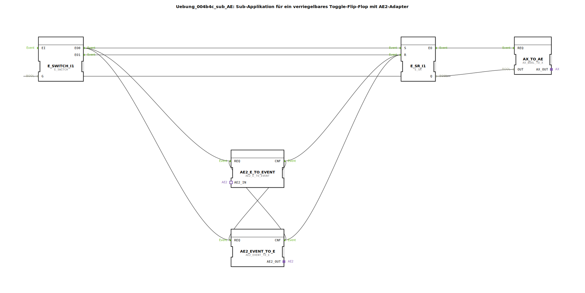

# Uebung_004b4c_sub_AE: Sub-Applikation für ein verriegelbares Toggle-Flip-Flop mit AE2-Adapter

* * * * * * * * * *

## Einleitung  
Diese Sub-Applikation realisiert ein verriegelbares Toggle-Flip-Flop, das über einen **AE2-Adapter (Socket)** gesteuert und über einen **AE2-Adapter (Plug)** sowie einen **AX-Adapter (Q)** rückgemeldet werden kann. Das Flip-Flop wird durch ein eingehendes Ereignis am Eingang `IND` umgeschaltet (Toggle‑Funktion). Zusätzlich kann es über den AE2‑Adapter zurückgesetzt werden, was die **Verriegelung** darstellt. Der aktuelle Zustand des Flip‑Flops wird über den AX‑Adapter ausgegeben.

## Verwendete Funktionsbausteine (FBs)

- **`E_SR_I1`** – Typ: `iec61499::events::E_SR`  
  Set‑Reset‑Flipflop mit booleschem Ausgang `Q`. Der Set‑Eingang `S` setzt `Q` auf `TRUE`, der Reset‑Eingang `R` setzt `Q` auf `FALSE`.

- **`E_SWITCH_I1`** – Typ: `iec61499::events::E_SWITCH`  
  Ereignisweiche. Ein eingehendes Ereignis am Eingang `EI` wird abhängig vom booleschen Wert am Eingang `G` entweder an den Ausgang `EO0` (wenn `G=FALSE`) oder an `EO1` (wenn `G=TRUE`) weitergeleitet.

- **`AE2_EVENT_TO_E`** – Typ: `adapter::conversion::bidirectional::AE2_EVENT_TO_E`  
  Wandelt ein über den **AE2-Socket** empfangenes Ereignis in ein internes Ereignis um. Am Ausgang `CNF` wird ein Ereignis ausgegeben, sobald ein Ereignis am Adapter anliegt.

- **`AE2_E_TO_EVENT`** – Typ: `adapter::conversion::bidirectional::AE2_E_TO_EVENT`  
  Wandelt ein internes Ereignis (Eingang `REQ`) in ein über den **AE2-Plug** sendbares Ereignis um. Das bestätigende Ereignis erscheint am Ausgang `CNF`.

- **`AX_TO_AE`** – Typ: `adapter::conversion::unidirectional::AX_BOOL_TO_X`  
  Konvertiert den booleschen Ausgang `Q` des Flip‑Flops in ein AX‑Adapter‑Signal, das am Plug `Q` ausgegeben wird.

## Programmablauf und Verbindungen

1. **Ereignisannahme**  
   Das eingehende Ereignis am Eingang `IND` wird direkt an den Ereigniseingang `EI` der Weiche `E_SWITCH_I1` weitergeleitet.

2. **Weichensteuerung durch Flip‑Flop‑Zustand**  
   Der Ausgang `Q` des Flip‑Flops `E_SR_I1` ist mit dem Steuereingang `G` der Weiche verbunden.  
   - Ist `Q = FALSE`, schaltet die Weiche das Ereignis auf ihren Ausgang `EO0`.  
   - Ist `Q = TRUE`, schaltet sie auf `EO1`.

3. **Toggle‑Funktion**  
   - `EO0` ist mit dem Set‑Eingang `S` des Flip‑Flops verbunden → setzt `Q` auf `TRUE`.  
   - `EO1` ist mit dem Reset‑Eingang `R` des Flip‑Flops verbunden → setzt `Q` auf `FALSE`.  
   Dadurch toggelt das Flip‑Flop bei jedem eingehenden Ereignis.

4. **Einbindung des AE2‑Adapters**  
   - Das Ereignis von `EO0` wird außerdem an die `REQ`-Eingänge **beider** Adapter‑Konverter (`AE2_EVENT_TO_E` und `AE2_E_TO_EVENT`) geleitet.  
   - Die Konverter sind gegenseitig verschaltet:  
     - Der `CNF`‑Ausgang von `AE2_EVENT_TO_E` triggert den `REQ`‑Eingang von `AE2_E_TO_EVENT` und geht gleichzeitig auf den Reset‑Eingang `R` des Flip‑Flops.  
     - Der `CNF`‑Ausgang von `AE2_E_TO_EVENT` triggert den `REQ`‑Eingang von `AE2_EVENT_TO_E` und geht ebenfalls auf den Reset‑Eingang `R` des Flip‑Flops.  
   - Diese Schleife sorgt dafür, dass **jedes** über den Socket ankommende Ereignis (gewandelt durch `AE2_EVENT_TO_E`) das Flip‑Flop zurücksetzt und gleichzeitig ein Ereignis an den Plug gesendet wird. Dadurch kann eine externe Steuerung das Flip‑Flop verriegeln.

5. **Ausgabe des Zustands**  
   Der boolesche Wert `Q` des Flip‑Flops wird über `AX_TO_AE` in ein AX‑Adapter‑Signal gewandelt und am Plug `Q` ausgegeben.

## Zusammenfassung  
Die Übung vertieft den Umgang mit **AE2‑Adaptern** zur bidirektionalen Ereigniskommunikation und demonstriert die Realisierung eines **verriegelbaren Toggle‑Flip‑Flops**. Der kombinierte Einsatz von Set‑Reset‑Flipflop, Ereignisweiche und Adapter‑Konvertern zeigt, wie ereignisgesteuerte Rückkopplungen und externe Steuereingriffe modular in 4diac‑IDE umgesetzt werden können.  
**Lernziele:**  
- Verständnis der AE2‑Adapter‑Kommunikation (Socket/Plug)  
- Aufbau einer Toggle‑Logik mit `E_SR` und `E_SWITCH`  
- Realisierung einer Verriegelung durch zyklische Ereignisverkettung  
- Einbindung von Adapter‑Konvertierungsbausteinen.