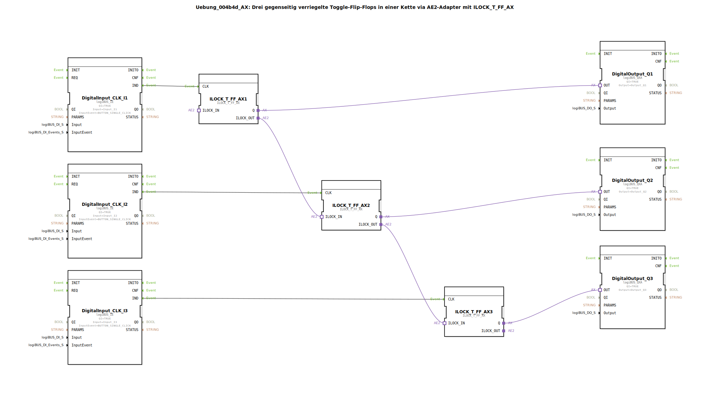

# Uebung_004b4d_AX: Drei gegenseitig verriegelte Toggle-Flip-Flops in einer Kette via AE2-Adapter mit ILOCK_T_FF_AX

* * * * * * * * * *

## Einleitung

Diese Übung implementiert drei gegenseitig verriegelte Toggle‑Flip‑Flops, die über einen AE2‑Adapter in einer Kette miteinander verbunden sind. Der Funktionsbaustein `ILOCK_T_FF_AX` ermöglicht es, durch Tastendruck (Single‑Click) einen Ausgang zu togglen. Dabei werden automatisch alle anderen Ausgänge zurückgesetzt (Verriegelung). Die Kette sorgt dafür, dass immer nur ein Ausgang aktiv sein kann.

## Verwendete Funktionsbausteine (FBs)

- **Digital Inputs (logiBUS_IE)** – drei Eingänge für Taster (Input_I1, Input_I2, Input_I3) mit Ereignis BUTTON_SINGLE_CLICK.
- **Digital Outputs (logiBUS_QXA)** – drei Ausgänge (Output_Q1, Output_Q2, Output_Q3) für die Anzeige der aktiven Flip‑Flop‑Stufe.
- **ILOCK_T_FF_AX** (logiBUS::signalprocessing::interlock::ILOCK_T_FF_AX) – dreimal verwendet:
  - **Funktionsweise**: Ein Bistabiles Element (Toggle‑Flip‑Flop) mit einem Takt‑Eingang `CLK` und einem Ausgang `Q`. Der interne Zustand wird bei jedem CLK‑Ereignis umgeschaltet. Über die Adapter `ILOCK_IN` und `ILOCK_OUT` wird eine gegenseitige Verriegelung realisiert: Sobald dieser FB aktiv wird, setzt er über `ILOCK_OUT` alle nachfolgenden FBs zurück, gleichzeitig sperrt `ILOCK_IN` den FB, falls ein vorgelagerter FB aktiv ist.

### Sub-Bausteine

Es sind keine Sub‑Bausteine innerhalb dieser SubApp definiert. Alle verwendeten FB‑Typen stammen aus der Bibliothek `logiBUS`.

## Programmablauf und Verbindungen

1. **Ereignisverkettung**  
   - Die drei Taster (`DigitalInput_CLK_I1`, `I2`, `I3`) erzeugen bei einem Single‑Click ein Ereignis `IND`.  
   - Dieses Ereignis wird direkt an den CLK‑Eingang des zugehörigen `ILOCK_T_FF_AX` weitergeleitet.

2. **Adapter‑Verbindungen (Verriegelungskette)**  
   - `ILOCK_T_FF_AX1.ILOCK_OUT` → `ILOCK_T_FF_AX2.ILOCK_IN`  
   - `ILOCK_T_FF_AX2.ILOCK_OUT` → `ILOCK_T_FF_AX3.ILOCK_IN`  
   - Dadurch entsteht eine Kaskade: Wird FB1 aktiv, sperrt es FB2; wird FB2 aktiv, sperrt es FB3. Ein nachfolgender FB kann nur aktiv werden, wenn der vorherige inaktiv ist.  
   - Ein Kommentar im Netzwerk weist darauf hin, dass durch den bidirektionalen Adapter nur eine Verbindung pro Stufe ausreicht.

3. **Ausgangsverkettung**  
   - Jeder `ILOCK_T_FF_AX` hat einen Ausgangs‑Adapter `Q`, der an den entsprechenden Digital‑Ausgang (`DigitalOutput_Q1`…`Q3`) angeschlossen ist.  
   - Die Ausgänge zeigen den Zustand des aktiven Flip‑Flops an.

4. **Ablauf**  
   - Durch Drücken von Taster I1, I2 oder I3 wird das jeweilige Flip‑Flop umgeschaltet.  
   - Wenn ein Flip‑Flop aktiv wird, werden alle nachfolgenden Flip‑Flops in der Kette zurückgesetzt.  
   - Ein vorher aktives Flip‑Flop bleibt nur aktiv, solange kein vorgelagertes Flip‑Flop getoggelt wird.

## Zusammenfassung

Die Übung demonstriert den Aufbau einer verriegelten Toggle‑Kette mit Hilfe des Funktionsbausteins `ILOCK_T_FF_AX`. Lernziele sind das Verständnis von:
- Toggle‑Flip‑Flops und deren Zustandswechsel,
- gegenseitiger Verriegelung (Interlocking) über Adapter‑Schnittstellen,
- kaskadierter Sperrlogik, bei der immer nur genau ein Ausgang aktiv sein kann.

Der Aufbau eignet sich für Anwendungen wie Umschalt‑ oder Prioritätssteuerungen, bei denen mehrere Bedienelemente exklusiv wirken sollen.