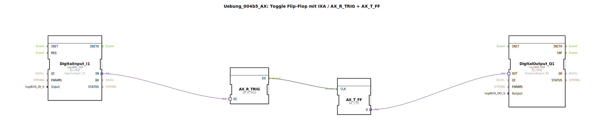

# Uebung_004b5_AX: Toggle Flip-Flop mit IXA / AX_R_TRIG + AX_T_FF

* * * * * * * * * *
## Einleitung

Diese Übung realisiert einen Toggle-Flipflop unter Verwendung eines logiBUS-Eingangs- und Ausgangs-Adapters (IXA/QXA) sowie der Adapter-Funktionsbausteine AX_R_TRIG (Flankendetektion) und AX_T_FF (Toggle-Flipflop). Das Verhalten: Bei jeder steigenden Flanke des digitalen Eingangssignals wechselt der Ausgang seinen Zustand (toggle).

## Verwendete Funktionsbausteine (FBs)

- **DigitalInput_I1** (Typ: logiBUS::io::DI::logiBUS_IXA)
  - Parameter: QI = TRUE, Input = Input_I1
  - Zweck: Liest den physikalischen digitalen Eingang „Input_I1“ und stellt das Signal als Adapterausgang IN bereit.
- **DigitalOutput_Q1** (Typ: logiBUS::io::DQ::logiBUS_QXA)
  - Parameter: QI = TRUE, Output = Output_Q1
  - Zweck: Gibt das an seinem Adaptereingang OUT anliegende Signal an den physikalischen digitalen Ausgang „Output_Q1“ weiter.
- **AX_R_TRIG** (Typ: adapter::events::unidirectional::AX_R_TRIG)
  - Ereignisse: Ereignisausgang EO wird bei einer steigenden Flanke am Adaptereingang QI ausgelöst.
- **AX_T_FF** (Typ: adapter::events::unidirectional::AX_T_FF)
  - Ereignisse: Ereigniseingang CLK toggelt den internen Zustand bei jedem anliegenden Ereignis. Der Ausgang Q spiegelt den aktuellen Zustand wider.

## Programmablauf und Verbindungen

Der Programmablauf ist über Adapter- und Ereignisverbindungen im Netzwerk festgelegt:

1. **Adapterverbindung** von `DigitalInput_I1.IN` zu `AX_R_TRIG.QI`:  
   Das Eingangssignal wird auf den Adaptereingang QI des Flankendetektors gegeben.

2. **Ereignisverbindung** von `AX_R_TRIG.EO` zu `AX_T_FF.CLK`:  
   Bei einer steigenden Flanke am Eingang erzeugt AX_R_TRIG ein Ereignis, das den Toggle-Flipflop taktet.

3. **Adapterverbindung** von `AX_T_FF.Q` zu `DigitalOutput_Q1.OUT`:  
   Der aktuelle Ausgangszustand des Toggle-Flipflops wird auf den Ausgangsadapter übertragen.

**Ablauf:**  
- Der digitale Eingang (z. B. ein Taster) liefert ein Signal.  
- Jede steigende Flanke (Signalwechsel von 0→1) am Eingang wird von `AX_R_TRIG` erkannt.  
- Daraufhin wird ein Ereignis an `AX_T_FF` gesendet, dessen Ausgang seinen Zustand umkehrt (toggle).  
- Der geänderte Zustand erscheint am digitalen Ausgang.

## Zusammenfassung

Die Übung demonstriert die Kombination von Adapter-Funktionsbausteinen zur Realisierung eines Toggle-Flipflops. Sie verbindet einen physikalischen Eingang über einen Flankendetektor mit einem Toggle-Element und gibt das Ergebnis an einen physikalischen Ausgang weiter. Dies ist eine typische Grundstruktur für das Umschalten eines Ausgangs mit einem einzelnen Taster in der Automatisierungstechnik.