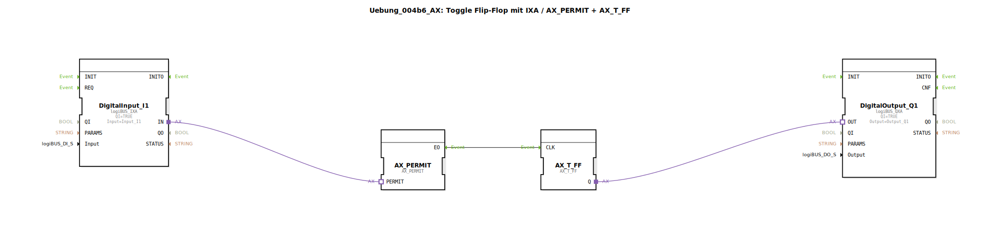

# Uebung_004b6_AX: Toggle Flip-Flop mit IXA / AX_PERMIT + AX_T_FF

* * * * * * * * * *
## Einleitung

Diese Übung demonstriert die Verwendung eines Toggle-Flip-Flops (T‑FF) in Kombination mit einem Freigabe-Mechanismus. Ein digitaler Eingang (logiBUS_IXA) wird über einen **AX_PERMIT**-Adapter an den Takteingang eines **AX_T_FF**-Adapters weitergeleitet. Der Ausgang des T‑FF steuert einen digitalen Ausgang (logiBUS_QXA). Dadurch kann der Zustand des Ausgangs bei jeder steigenden Flanke am Eingang umgeschaltet werden – jedoch nur, wenn der Eingang vorher vom **AX_PERMIT** freigegeben wurde.

## Verwendete Funktionsbausteine (FBs)

| FB-Instanz | Typ | Parameter |
|------------|-----|-----------|
| `DigitalInput_I1` | `logiBUS::io::DI::logiBUS_IXA` | `QI = TRUE`, `Input = "Input_I1"` |
| `DigitalOutput_Q1` | `logiBUS::io::DQ::logiBUS_QXA` | `QI = TRUE`, `Output = "Output_Q1"` |
| `AX_PERMIT` | `adapter::events::unidirectional::AX_PERMIT` | (keine Parameter gesetzt) |
| `AX_T_FF` | `adapter::events::unidirectional::AX_T_FF` | (keine Parameter gesetzt) |

### Kurzbeschreibung der Adapter

- **logiBUS_IXA**: Liest einen digitalen Eingang der logiBUS-Hardware ein.  
- **logiBUS_QXA**: Schaltet einen digitalen Ausgang der logiBUS-Hardware.  
- **AX_PERMIT**: Ein Adapter, der ein eingehendes Ereignis nur dann weitergibt, wenn der angeschlossene Adapter-Eingang (hier der Eingangswert) aktiv ist.  
- **AX_T_FF**: Ein Toggle-Flip-Flop-Adapter. Bei jedem Ereignis am Takteingang (CLK) wird der interne Zustand umgeschaltet und über den Ausgang (Q) bereitgestellt.

## Programmablauf und Verbindungen

Das Diagramm zeigt folgende Verbindungen (aus der SubAppNetwork-Konfiguration):

1. **Adapterverbindung**:
   - `DigitalInput_I1.IN` (Ausgang des Eingangsbausteins) → `AX_PERMIT.PERMIT`  
     *(Der digitale Eingangswert aktiviert die Freigabe des AX_PERMIT-Adapters.)*

2. **Ereignisverbindung**:
   - `AX_PERMIT.EO` (Ereignisausgang des Freigabeadapters) → `AX_T_FF.CLK`  
     *(Nur wenn die Freigabe aktiv ist, wird ein Ereignis an den Takteingang des T‑FF gesendet.)*

3. **Adapterverbindung**:
   - `AX_T_FF.Q` (Zustandsausgang des T‑FF) → `DigitalOutput_Q1.OUT`  
     *(Der aktuelle Flip-Flop-Zustand wird an den digitalen Ausgang weitergegeben.)*

**Funktionsweise im Detail:**

- Der Eingang `Input_I1` wird ständig von `DigitalInput_I1` gelesen.  
- Der gelesene Wert (TRUE/FALSE) wird als Freigabesignal an `AX_PERMIT.PERMIT` übergeben.  
- Ein Ereignis (z. B. eine steigende Flanke am Eingang) tritt nicht explizit auf – die Ereignissteuerung erfolgt über die Laufzeitumgebung. Der **AX_PERMIT**-Adapter gibt ein intern generiertes Ereignis nur weiter, wenn der Freigabeeingang `TRUE` ist.  
- Dieses Ereignis gelangt an den Takteingang des **AX_T_FF**, der daraufhin seinen Ausgangszustand umschaltet.  
- Der neue Zustand wird am Ausgang `Output_Q1` ausgegeben.

Die Kombination erlaubt es, mit einem einzigen digitalen Eingang einen Ausgang wechselweise ein- und auszuschalten – jedoch nur, solange der Eingang aktiv ist (Freigabe). Sobald der Eingang auf FALSE geht, werden keine weiteren Taktimpulse mehr durchgelassen, und der Ausgang behält seinen letzten Zustand.

## Zusammenfassung

Die Übung „Uebung_004b6_AX“ veranschaulicht die Kopplung von Hardware-Adaptern (logiBUS) mit Ereignis-/Daten-Adaptern (AX_PERMIT, AX_T_FF). Sie zeigt, wie ein Toggle-Flip-Flop realisiert werden kann, dessen Takt freigabegesteuert ist. Dieses Grundprinzip findet Anwendung in der Steuerungstechnik, z. B. zum Umschalten von Betriebsarten oder zum Entprellen von Signalen.