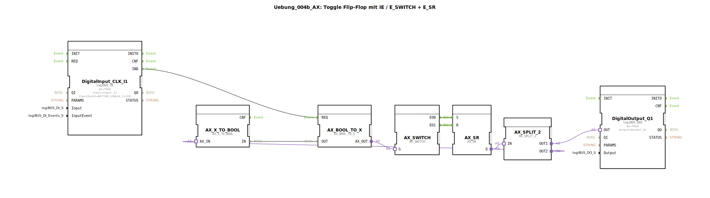

# Uebung_004b_AX: Toggle Flip-Flop mit IE / E_SWITCH + E_SR

Dieser Artikel beschreibt die logiBUS®-Übung `Uebung_004b_AX`. Diese Übung zeigt eine alternative Implementierung eines Stromstoßschalters unter Verwendung von Daten-zu-Event-Konvertierung und Weichen.

> **Hinweis:** Diese Lösung gilt als "nicht empfohlen" (siehe Kommentar im Code), da sie unnötig komplex ist. Sie dient hier als Lehrbeispiel für die Bausteine `AX_SWITCH`, `AX_BOOL_TO_X` und `AX_X_TO_BOOL`.

----

## Ziel der Übung

Verständnis der Interaktion zwischen booleschen Daten und Event-Fluss-Steuerung.

-----

## Beschreibung und Komponenten

[cite_start]Die Subapplikation `Uebung_004b_AX.SUB` baut einen Toggle-Mechanismus diskret auf[cite: 1].

### Funktionsbausteine (FBs)

  * **`DigitalInput_CLK_I1`**: Liefert ein Event bei Klick.
  * **`AX_BOOL_TO_X`**: Wandelt einen booleschen Wert in ein Adapter-Signal (Daten + Event) um. Hier genutzt, um den aktuellen Zustand des Flip-Flops in ein Steuersignal für den Switch zu wandeln.
  * **`AX_SWITCH`**: Eine Weiche. Je nach Wert am Eingang `G` leitet sie ein Event entweder an `EO0` oder `EO1`.
  * **`E_SR`**: Set/Reset Flip-Flop (Ereignisbasiert).
  * **`AX_SPLIT_2`**: Verteilt den Ausgang des Flip-Flops (einmal zur Lampe, einmal zur Rückkopplung).
  * **`AX_X_TO_BOOL`**: Extrahiert den booleschen Zustand aus dem Adapter-Signal für die Rückkopplung.

-----

## Funktionsweise

Der Grundgedanke ist:
1.  Ein Klick-Event kommt an.
2.  Wohin soll es gehen? -> Zum "Einschalten" (`S`) oder zum "Ausschalten" (`R`)?
3.  Das entscheidet der `AX_SWITCH` basierend auf dem *aktuellen* Zustand.
    *   Ist die Lampe aus (`G=0`), geht das Event zu `EO0` -> `E_SR.S` (Setzen).
    *   Ist die Lampe an (`G=1`), geht das Event zu `EO1` -> `E_SR.R` (Rücksetzen).

Diese Rückkopplungsschleife (Feedback Loop) macht aus dem SR-Flip-Flop effektiv ein Toggle-Flip-Flop.

-----

## Bewertung

Warum ist das "schlecht"?
*   Hoher Baustein-Aufwand für eine simple Funktion.
*   Rückkopplungsschleifen können in ereignisbasierten Systemen zu "Race Conditions" oder unendlichen Loops führen, wenn man nicht aufpasst (hier durch die Trennung von Event und Datenpfad zwar funktional, aber schwer lesbar).
*   Ein einfaches `AX_T_FF` (wie in Übung 004a) erledigt dasselbe in einem Baustein.