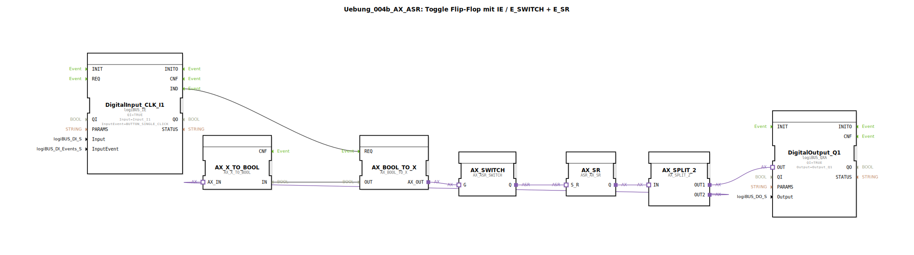

Hier ist die Dokumentation für die Übung `Uebung_004b_AX_ASR` basierend auf den bereitgestellten Informationen.

# Uebung_004b_AX_ASR: Toggle Flip-Flop mit IE / E_SWITCH + E_SR

* * * * * * * * * *

## Einleitung

Die Übung **Uebung_004b_AX_ASR** implementiert eine Toggle-Flip-Flop-Logik (Umschalter), jedoch unter Verwendung spezieller Adapter-Bausteine anstelle der klassischen booleschen Logikbausteine. Ziel ist es, den Status eines digitalen Ausgangs (Q1) bei jedem Klick auf einen Taster (I1) zu wechseln (Ein/Aus).

Diese Übung dient primär Demonstrationszwecken, um die Funktionsweise und Verkettung von Adapter-Events und -Daten zu zeigen. Wie im Quellcode vermerkt, ist diese Umsetzung für einfache Schaltaufgaben aufgrund der hohen Komplexität und Anzahl der Bausteine in der Praxis **nicht empfohlen**.

## Verwendete Funktionsbausteine (FBs)

In dieser Sub-Application werden verschiedene Bausteine aus der `logiBUS` und der `adapter` Bibliothek verwendet, um die Logik abzubilden.

### LogiBUS IO Bausteine

*   **DigitalInput_CLK_I1** (`logiBUS::io::DI::logiBUS_IE`)
    *   Dient als Eingangsereignis.
    *   **Parameter**: `Input` = `Input_I1` (Logischer Eingang 1), `InputEvent` = `BUTTON_SINGLE_CLICK` (Reagiert auf einfachen Klick).
    *   **Funktion**: Liefert ein Event-Signal, wenn der Taster gedrückt wird.
*   **DigitalOutput_Q1** (`logiBUS::io::DQ::logiBUS_QXA`)
    *   Dient als Ausgangsschnittstelle.
    *   **Parameter**: `Output` = `Output_Q1`.
    *   **Funktion**: Steuert den physischen Ausgang basierend auf dem Adapter-Signal.

### Adapter-Logik Bausteine

Diese Bausteine verarbeiten Signale über Adapter-Verbindungen (`AX_...`), welche Daten und Events kapseln.

*   **AX_SR** (`adapter::events::unidirectional::AX_SR`)
    *   **Typ**: Set/Reset-Flip-Flop (Adapter-Variante).
    *   **Funktion**: Speichert den Zustand (Ein/Aus). Er wird durch Events an den Eingängen `S` (Set) und `R` (Reset) gesteuert und gibt den Status über den Adapter-Ausgang `Q` aus.
*   **AX_SWITCH** (`adapter::events::unidirectional::AX_SWITCH`)
    *   **Typ**: Weiche/Schalter.
    *   **Funktion**: Leitet eingehende Signale basierend auf dem Zustand an verschiedene Ausgänge (`EO0`, `EO1`) weiter. Hier genutzt, um zwischen Setzen und Rücksetzen des Flip-Flops zu wechseln.
*   **AX_SPLIT_2** (`adapter::events::unidirectional::AX_SPLIT_2`)
    *   **Typ**: Signal-Splitter.
    *   **Funktion**: Teilt den Adapter-Ausgang des Flip-Flops auf zwei Pfade auf: einen für den physischen Ausgang und einen für die Rückkopplung (Feedback).
*   **AX_BOOL_TO_X** (`adapter::conversion::unidirectional::AX_BOOL_TO_X`)
    *   **Typ**: Konverter.
    *   **Funktion**: Wandelt ein klassisches Event- und Datensignal in ein Adapter-Signal um, um den `AX_SWITCH` anzusteuern.
*   **AX_X_TO_BOOL** (`adapter::conversion::unidirectional::AX_X_TO_BOOL`)
    *   **Typ**: Konverter.
    *   **Funktion**: Wandelt ein Adapter-Signal zurück in klassische Daten, um den aktuellen Status für die Rückkopplung bereitzustellen.

## Programmablauf und Verbindungen

Der Ablauf simuliert ein T-Flip-Flop durch eine Rückkopplungsschleife:

1.  **Eingangssignal**: Das Event `IND` vom Taster **DigitalInput_CLK_I1** triggert den Baustein **AX_BOOL_TO_X**.
2.  **Status-Erfassung**: Der aktuelle Status des Systems wird über eine Rückkopplung (Feedback Loop) ermittelt. Der Ausgang des Flip-Flops (**AX_SR**) wird über **AX_SPLIT_2** und **AX_X_TO_BOOL** zurückgeführt und in **AX_BOOL_TO_X** eingespeist.
3.  **Schaltlogik**:
    *   Der **AX_SWITCH** erhält das Signal.
    *   Abhängig vom aktuellen Zustand (Rückkopplung) wird entweder der Ausgang `EO0` (verbunden mit `AX_SR.S` -> Setzen) oder `EO1` (verbunden mit `AX_SR.R` -> Rücksetzen) aktiviert.
4.  **Speicherung**: Der **AX_SR** Baustein ändert seinen Zustand entsprechend (Toggeln).
5.  **Ausgabe**: Der neue Zustand steht am Adapter-Ausgang `Q` von **AX_SR** bereit.
6.  **Verteilung**:
    *   Über **AX_SPLIT_2** geht das Signal an den **DigitalOutput_Q1**, wodurch die Lampe/der Aktor geschaltet wird.
    *   Gleichzeitig wird das Signal für den nächsten Klick wieder in die Rückkopplungsschleife geleitet.

**Hinweis zur Komplexität:**
Im Netzwerk-Diagramm ist ein Kommentar hinterlegt: *"nicht empfohlen !!! viel zu viel Bausteine"*. Dies unterstreicht, dass diese Lösung für eine einfache Toggle-Funktion in einer produktiven Umgebung übermäßig komplex ist (Over-Engineering). Ein einfacher `E_T_FF` (Toggle Flip-Flop) oder eine Kombination aus `E_SWITCH` und `E_SR` ohne Adapter-Kapselung wäre effizienter.

## Zusammenfassung

Die Übung `Uebung_004b_AX_ASR` demonstriert die Realisierung eines Toggle-Flip-Flops unter ausschließlicher Verwendung von Adapter-Bausteinen (`AX_`) und Konvertern. Sie zeigt anschaulich, wie Adapter-Verbindungen gesplittet und konvertiert werden können, dient aber gleichzeitig als Negativbeispiel für die Effizienz bei simplen Logikaufgaben. Das Lernziel liegt im Verständnis der Adapter-Technologie innerhalb der 4diac IDE.