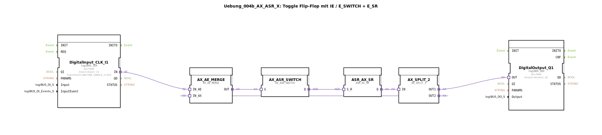

Hier ist die Dokumentation für die Übung `Uebung_004b_AX_ASR_X`.

# Uebung_004b_AX_ASR_X: Toggle Flip-Flop mit IE / E_SWITCH + E_SR

* * * * * * * * * *

## Einleitung
Diese Übung implementiert ein **Toggle-Flip-Flop** (Umschalter), jedoch unter Verwendung eines sehr speziellen Ansatzes mittels Adapter-Bausteinen (`AX`). Ziel der Schaltung ist es, bei einem Eingangssignal (Tastendruck) den Ausgangszustand zu wechseln (An -> Aus -> An).

Besonderheit dieser Übung ist der Hinweis im Quellcode, dass dieser Lösungsweg aufgrund der hohen Anzahl an Bausteinen für diese simple Aufgabe **nicht empfohlen** ist. Sie dient primär dem Verständnis von Adapter-Verbindungen, Signal-Splitting und Rückkopplungsschleifen in 4diac.

## Verwendete Funktionsbausteine (FBs)

In dieser Sub-Application kommen verschiedene Bausteine aus der `logiBUS` Bibliothek für die IO-Anbindung sowie Bausteine aus der `adapter` Bibliothek für die logische Verarbeitung zum Einsatz.

### Haupt-Bausteine:

#### **DigitalInput_CLK_I1**
- **Typ**: `logiBUS::io::DI::logiBUS_IE`
- **Beschreibung**: Dieser Baustein erfasst das Eingangssignal (Taster).
- **Parameter**:
    - `QI` = `TRUE`
    - `Input` = `Input_I1`
    - `InputEvent` = `BUTTON_SINGLE_CLICK`
- **Funktion**: Sendet ein Event (`IND`), wenn die Taste einmal gedrückt wird.

#### **DigitalOutput_Q1**
- **Typ**: `logiBUS::io::DQ::logiBUS_QXA`
- **Beschreibung**: Steuert den physischen Ausgang an.
- **Parameter**:
    - `QI` = `TRUE`
    - `Output` = `Output_Q1`
- **Funktion**: Übernimmt den Status vom Adapter-Netzwerk und schaltet den Ausgang entsprechend.

#### **AX_SR**
- **Typ**: `adapter::events::unidirectional::AX_SR`
- **Beschreibung**: Ein Speicher-Baustein (Set/Reset) auf Adapter-Basis.
- **Funktion**: Speichert den aktuellen Zustand (TRUE oder FALSE). Er wird über die Eingänge `S` (Setzen) und `R` (Rücksetzen) gesteuert.

#### **AX_SWITCH**
- **Typ**: `adapter::events::unidirectional::AX_SWITCH`
- **Beschreibung**: Dient als Weiche für Events/Adapter-Signale.
- **Funktion**: Leitet das eingehende Signal basierend auf dem Status am Eingang `G` entweder auf `EO0` oder `EO1` weiter.

#### **AX_SPLIT_2**
- **Typ**: `adapter::events::unidirectional::AX_SPLIT_2`
- **Beschreibung**: Ein Splitter-Baustein.
- **Funktion**: Teilt ein eingehendes Adapter-Signal (`IN`) auf zwei Ausgänge (`OUT1`, `OUT2`) auf. Dies wird hier benötigt, um den Ausgangszustand gleichzeitig an den physischen Ausgang zu senden und als Rückkopplung für die Logik zu nutzen.

#### **AX_BOOL_TO_X** & **AX_X_TO_BOOL**
- **Typ**: `adapter::conversion::unidirectional::...`
- **Beschreibung**: Konvertierungsbausteine.
- **Funktion**: Dienen der Umwandlung zwischen klassischen Datentypen und Adapter-Strukturen, um die Rückkopplungsschleife zu schließen.

## Programmablauf und Verbindungen

Die Logik dieser Übung basiert auf einer Rückkopplung des aktuellen Zustands, um zu entscheiden, ob beim nächsten Tastendruck eingeschaltet (Set) oder ausgeschaltet (Reset) werden soll.

1.  **Eingangssignal**: Ein Klick auf `DigitalInput_CLK_I1` löst ein Event aus (`IND`), welches den Konverter `AX_BOOL_TO_X` aktiviert (`REQ`).
2.  **Entscheidungslogik (Weiche)**: Das Signal gelangt zum `AX_SWITCH` (Eingang `G`).
3.  **Zustandsänderung**:
    *   Der `AX_SWITCH` ist mit dem `AX_SR` (Speicher) verbunden.
    *   Über `EO0` wird der Speicher gesetzt (`S`).
    *   Über `EO1` wird der Speicher zurückgesetzt (`R`).
    *   Welcher Weg gewählt wird, hängt vom aktuellen Zustand der Rückkopplung ab.
4.  **Ausgabe und Rückkopplung**:
    *   Der Ausgang des Speichers `AX_SR` geht in den Splitter `AX_SPLIT_2`.
    *   **Zweig 1 (`OUT1`)**: Geht direkt an den `DigitalOutput_Q1`, um die Lampe zu schalten.
    *   **Zweig 2 (`OUT2`)**: Wird zurückgeführt. Er läuft über `AX_X_TO_BOOL` (Konvertierung) zurück zu `AX_BOOL_TO_X`.
5.  **Der Zyklus**: Durch diese Rückführung (Feedback Loop) "weiß" das System beim nächsten Klick, in welchem Zustand es sich befindet, und der `AX_SWITCH` schaltet entsprechend in den entgegengesetzten Zustand.

## Zusammenfassung

Die Übung **Uebung_004b_AX_ASR_X** demonstriert die Erstellung eines Toggle-Flip-Flops unter ausschließlicher Verwendung von Adapter-Event-Bausteinen und Konvertern.

Obwohl die Funktionalität (Taster drücken -> Licht an, Taster drücken -> Licht aus) gegeben ist, zeigt der interne Kommentar ("nicht empfohlen !!! viel zu viel Bausteine"), dass dies eine akademische Übung ist. Sie verdeutlicht, wie man komplexe Adapter-Netzwerke mit Rückkopplungen und Signalweichen (`SWITCH` und `SPLIT`) aufbaut, stellt jedoch keine effiziente Lösung für eine einfache Stromstoßschaltung dar.