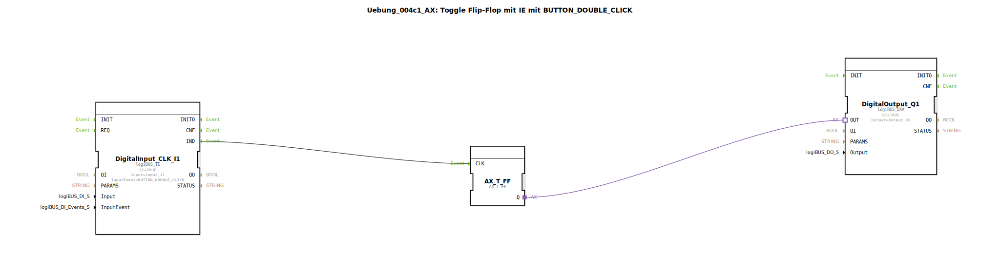

# Uebung_004c1_AX: Toggle Flip-Flop mit IE mit BUTTON_DOUBLE_CLICK

Dieser Artikel beschreibt die logiBUS®-Übung `Uebung_004c1_AX`. Ab hier widmen wir uns den erweiterten Fähigkeiten des `logiBUS_IE` Bausteins, der komplexe Taster-Muster erkennen kann.

----

## Ziel der Übung

Nutzung des Ereignisses `BUTTON_DOUBLE_CLICK`.

-----

## Beschreibung und Komponenten

[cite_start]Die Subapplikation `Uebung_004c1_AX.SUB` schaltet eine Lampe nur bei einem Doppelklick um[cite: 1].

### Funktionsbausteine (FBs)

  * **`DigitalInput_CLK_I1`**: Konfiguriert mit `InputEvent = BUTTON_DOUBLE_CLICK`.

-----

## Funktionsweise

Der Baustein überwacht den Eingang `I1`.
1.  Drückt man einmal: Nichts passiert am Ausgang `IND`.
2.  Drückt man zweimal kurz hintereinander (innerhalb einer definierten Zeitspanne): Der Baustein feuert *ein* `IND` Event.
3.  Das Flip-Flop toggelt.

-----

## Anwendungsbeispiel

**Vermeidung von Fehlbedienung**: Kritische Funktionen (z.B. "Alle Löschen") auf einen Doppelklick legen, damit sie nicht versehentlich ausgelöst werden.