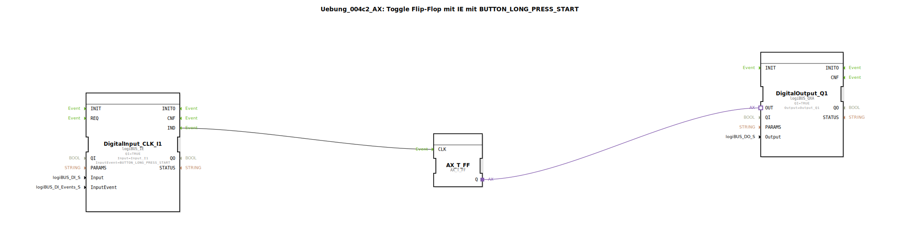

# Uebung_004c2_AX: Toggle Flip-Flop mit IE mit BUTTON_LONG_PRESS_START

Dieser Artikel beschreibt die logiBUS®-Übung `Uebung_004c2_AX`.

----

## Ziel der Übung

Nutzung des Ereignisses `BUTTON_LONG_PRESS_START`.

-----

## Funktionsweise

[cite_start]Der Baustein `DigitalInput_CLK_I1` in `Uebung_004c2_AX.SUB` ist auf `BUTTON_LONG_PRESS_START` konfiguriert[cite: 1].

Das Event `IND` wird gefeuert, sobald der Taster eine bestimmte Zeit lang gedrückt *gehalten wurde* (z.B. > 500ms). Es feuert genau in dem Moment, in dem die Zeit abgelaufen ist, auch wenn der Taster noch weiter gedrückt bleibt.

-----

## Anwendungsbeispiel

**Licht dimmen**: Ein kurzer Klick schaltet Ein/Aus (siehe Übung 004a). Ein langer Druck (erkannt durch `LONG_PRESS_START`) startet den Dimm-Vorgang.