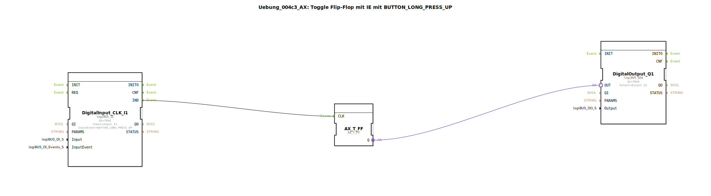

# Uebung_004c3_AX: Toggle Flip-Flop mit IE mit BUTTON_LONG_PRESS_UP

Dieser Artikel beschreibt die logiBUS®-Übung `Uebung_004c3_AX`.

----

## Ziel der Übung

Nutzung des Ereignisses `BUTTON_LONG_PRESS_UP`.

-----

## Funktionsweise

[cite_start]Der Baustein `DigitalInput_CLK_I1` in `Uebung_004c3_AX.SUB` ist auf `BUTTON_LONG_PRESS_UP` konfiguriert[cite: 1].

Das Event wird gefeuert, wenn der Taster losgelassen wird, *nachdem* er als "lang gedrückt" erkannt wurde. Ein kurzes Tippen löst dieses Event nicht aus (das wäre `SINGLE_CLICK`).

-----

## Anwendungsbeispiel

**Dimm-Vorgang beenden**: Wenn der Benutzer den Taster loslässt, soll das Dimmen stoppen und der aktuelle Helligkeitswert gespeichert werden.