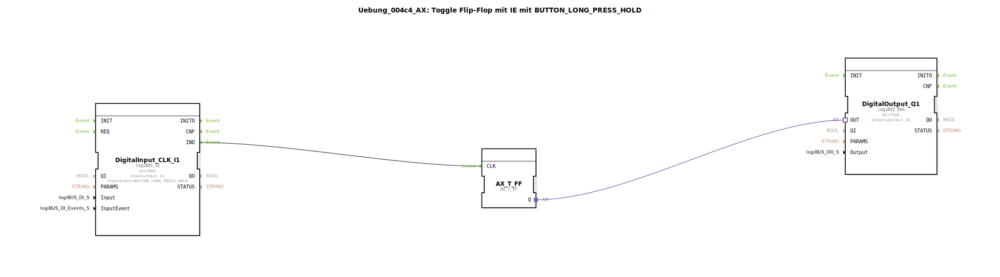

# Uebung_004c4_AX: Toggle Flip-Flop mit IE mit BUTTON_LONG_PRESS_HOLD

Dieser Artikel beschreibt die logiBUS®-Übung `Uebung_004c4_AX`.

----

## Ziel der Übung

Nutzung des Ereignisses `BUTTON_LONG_PRESS_HOLD`.

-----

## Funktionsweise

[cite_start]Der Baustein `DigitalInput_CLK_I1` in `Uebung_004c4_AX.SUB` ist auf `BUTTON_LONG_PRESS_HOLD` konfiguriert[cite: 1].

Dieses Event wird *periodisch* gefeuert, solange der Taster nach Erkennung des langen Drucks weiterhin gehalten wird.

-----

## Anwendungsbeispiel

**Lautstärke ändern / Scrollen**: Solange man die Taste gedrückt hält, wird die Lautstärke schrittweise erhöht oder durch ein Menü gescrollt. Das Toggle-FF würde hier sehr schnell an und aus gehen (Flackern), was zeigt, dass dieses Event eher für Inkrement-Funktionen als für Toggles gedacht ist.