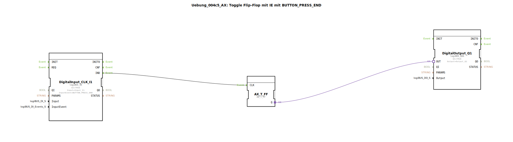

# Uebung_004c5_AX: Toggle Flip-Flop mit IE mit BUTTON_PRESS_END

Dieser Artikel beschreibt die logiBUS®-Übung `Uebung_004c5_AX`.

----

## Ziel der Übung

Nutzung des Ereignisses `BUTTON_PRESS_END`.

-----

## Funktionsweise

[cite_start]Der Baustein `DigitalInput_CLK_I1` in `Uebung_004c5_AX.SUB` ist auf `BUTTON_PRESS_END` konfiguriert[cite: 1].

Dieses Event feuert *immer*, wenn der Taster losgelassen wird, egal ob kurz oder lang gedrückt wurde.

-----

## Anwendungsbeispiel

**Totmannschalter**: Eine Funktion ist aktiv, solange gedrückt wird (Start beim Pegel-Wechsel auf HIGH), und muss sicher stoppen, wenn losgelassen wird (`PRESS_END`).