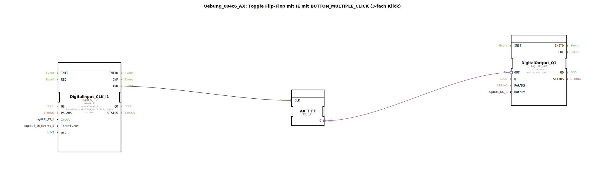

# Uebung_004c6_AX: Toggle Flip-Flop mit IE mit BUTTON_MULTIPLE_CLICK (3-fach Klick)

Dieser Artikel beschreibt die logiBUS®-Übung `Uebung_004c6_AX`. Hier wird der erweiterte `logiBUS_IE2` Baustein genutzt, der Argumente akzeptiert.

----

## Ziel der Übung

Konfiguration eines n-fach Klicks.

-----

## Beschreibung und Komponenten

[cite_start]Die Subapplikation `Uebung_004c6_AX.SUB` nutzt `logiBUS_IE2` mit `InputEvent = BUTTON_MULTIPLE_CLICK` und `arg = 3`[cite: 1].

### Funktionsbausteine (FBs)

  * **`DigitalInput_CLK_I1`**: Typ `logiBUS_IE2`. Dieser Typ hat den zusätzlichen Eingang `arg`.

-----

## Funktionsweise

Das Event feuert nur, wenn der Benutzer exakt dreimal kurz hintereinander klickt (Triple-Click).

-----

## Anwendungsbeispiel

**Versteckte Service-Menüs**: Zugriff auf Experten-Einstellungen, die ein normaler Nutzer nicht versehentlich aktivieren soll.