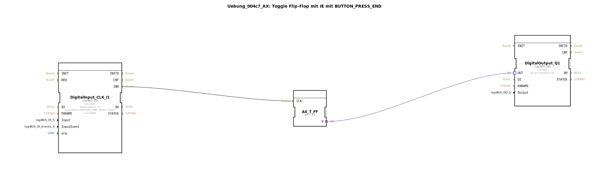

# Uebung_004c7_AX: Toggle Flip-Flop mit IE mit BUTTON_PRESS_END

Dieser Artikel beschreibt die logiBUS®-Übung `Uebung_004c7_AX`. Auch hier wird `logiBUS_IE2` genutzt, um die Zeitdauer für einen "langen Druck" anzupassen.

----

## Ziel der Übung

Definition einer spezifischen Haltezeit.

-----

## Beschreibung und Komponenten

[cite_start]Die Subapplikation `Uebung_004c7_AX.SUB` nutzt `logiBUS_IE2` mit `InputEvent = BUTTON_LONG_PRESS_START` und `arg = 3000` (ms)[cite: 1].

-----

## Funktionsweise

Das Event feuert erst, wenn der Taster für **3 Sekunden** (3000ms) gedrückt gehalten wird. Dies überschreibt den Standardwert (der meist bei 500ms oder 1s liegt).

-----

## Anwendungsbeispiel

**Werkseinstellungen laden**: Eine sehr destruktive Aktion, die extrem gut gegen versehentliches Auslösen geschützt sein muss. Der Nutzer muss bewusst lange drücken.