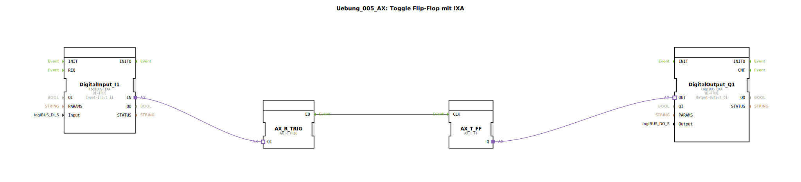

# Uebung_005_AX: Toggle Flip-Flop mit IXA

Dieser Artikel beschreibt die logiBUS®-Übung `Uebung_005_AX`. Diese Übung zeigt, wie man einen zustandsbasierten Eingang (`IXA`) nutzt, um ein ereignisbasiertes Flip-Flop zu steuern.

----

## Ziel der Übung

Demonstration der Konvertierung von Daten zu Ereignissen für Steuerungszwecke.

-----

## Beschreibung und Komponenten

[cite_start]Die Subapplikation `Uebung_005_AX.SUB` verwendet einen Standard-Digitaleingang (`logiBUS_IXA`) anstelle eines Event-Eingangs (`logiBUS_IE`)[cite: 1].

### Funktionsbausteine (FBs)

  * **`DigitalInput_I1`**: Typ `logiBUS_IXA`. Liefert kontinuierlich TRUE, wenn gedrückt.
  * **`AX_SWITCH`**: Dient hier als Gatter.
  * **`AX_T_FF`**: Das Toggle-Flip-Flop.

-----

## Funktionsweise

Die Schaltung nutzt die Tatsache, dass der `IXA` bei jeder Änderung auch ein Adapter-Event sendet.
1.  Wenn `I1` gedrückt wird (FALSE -> TRUE), sendet der Adapter ein Event und `D1=TRUE`.
2.  Der `AX_SWITCH` bekommt das Event. Da `G` (verbunden mit `I1.IN`) nun TRUE ist, leitet er das Event an `EO1` weiter.
3.  `EO1` triggert das Flip-Flop -> Licht schaltet um.
4.  Wenn `I1` losgelassen wird (TRUE -> FALSE), sendet der Adapter wieder ein Event, aber `D1=FALSE`.
5.  Der `AX_SWITCH` leitet das Event an `EO0` (hier offen) weiter. Das Flip-Flop wird nicht getriggert.

Das Ergebnis ist eine korrekte Flankenauswertung (nur bei steigender Flanke wird geschaltet).

-----

## Bewertung

Dies ist eine valide Methode, wenn man nur `IXA` Bausteine zur Verfügung hat und keinen `IE` nutzen kann oder will. Es ist jedoch ressourcenintensiver als die Nutzung des spezialisierten `IE` Bausteins mit `SINGLE_CLICK` Event.