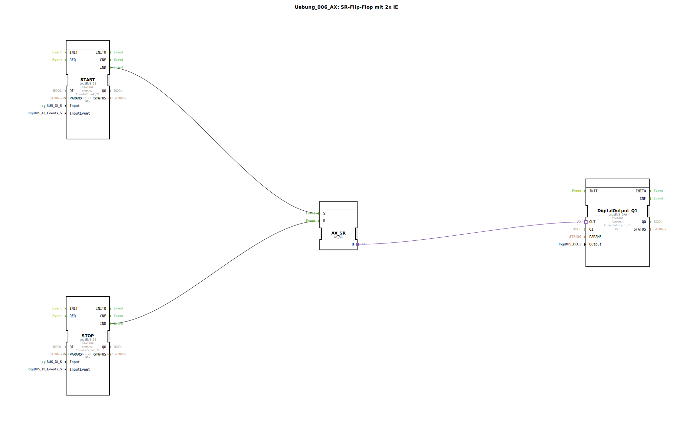

# Uebung_006_AX: SR-Flip-Flop mit 2x IE

Dieser Artikel beschreibt die logiBUS®-Übung `Uebung_006_AX`. Hier wird das klassische RS-Glied (Speicherglied) implementiert.

----

## Ziel der Übung

Realisierung einer Schaltung mit getrennten Tastern für "Ein" und "Aus".

-----

## Beschreibung und Komponenten

[cite_start]Die Subapplikation `Uebung_006_AX.SUB` nutzt zwei Taster und einen `AX_SR` Baustein[cite: 1].

### Funktionsbausteine (FBs)

  * **`I1` (Set)**: Taster zum Einschalten.
  * **`I2` (Reset)**: Taster zum Ausschalten.
  * **`AX_SR`**: Ein SR-Flip-Flop (Set dominant, falls gleichzeitig, aber hier durch Events getrennt).

-----

## Funktionsweise

*   Ein Klick auf `I1` sendet ein Event an `S` -> Ausgang `Q` wird TRUE.
*   Ein Klick auf `I2` sendet ein Event an `R` -> Ausgang `Q` wird FALSE.
*   Mehrmaliges Drücken von `I1` ändert nichts, wenn es schon an ist.

-----

## Anwendungsbeispiel

**Maschinensteuerung**: Ein grüner Taster startet den Motor, ein roter Taster stoppt ihn. Dies ist sicherer als ein Toggle-Taster, da der Bediener immer definiert "Aus" drücken kann.