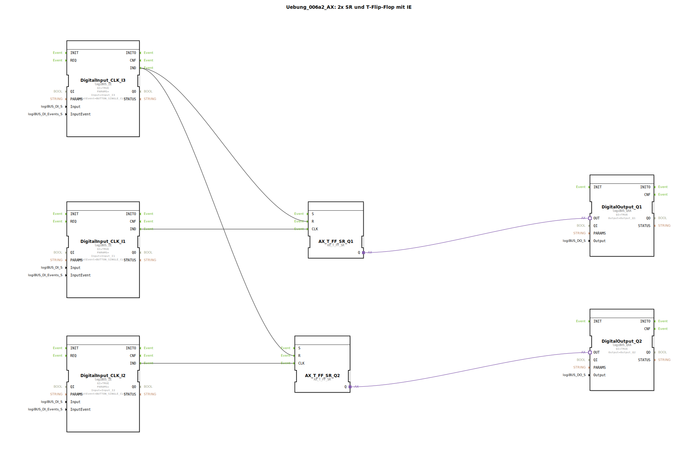

# Uebung_006a2_AX: 2x SR und T-Flip-Flop mit IE

Dieser Artikel beschreibt die logiBUS®-Übung `Uebung_006a2_AX`.

----

## Ziel der Übung

Demonstration einer Zentral-Aus-Funktion.

-----

## Beschreibung und Komponenten

[cite_start]Die Subapplikation `Uebung_006a2_AX.SUB` steuert zwei unabhängige Lampen, die gemeinsam gelöscht werden können[cite: 1].

### Funktionsbausteine (FBs)

  * **`I1`**: Toggelt Lampe 1.
  * **`I2`**: Toggelt Lampe 2.
  * **`I3`**: Reset für beide.
  * **2x `AX_T_FF_SR`**: Je einer pro Lampe.

-----

## Funktionsweise

*   `I1` ist mit `CLK` von FF1 verbunden.
*   `I2` ist mit `CLK` von FF2 verbunden.
*   `I3` ist mit `R` von **beiden** Flip-Flops verbunden (Fan-Out).

Ein Druck auf `I3` schaltet sofort beide Lampen aus, egal in welchem Zustand sie waren.

-----

## Anwendungsbeispiel

**Bürobeleuchtung**: Jeder Schreibtisch hat sein eigenes Licht (`I1`, `I2`), aber am Ausgang gibt es einen Schalter "Raum verlassen", der alles ausschaltet (`I3`).