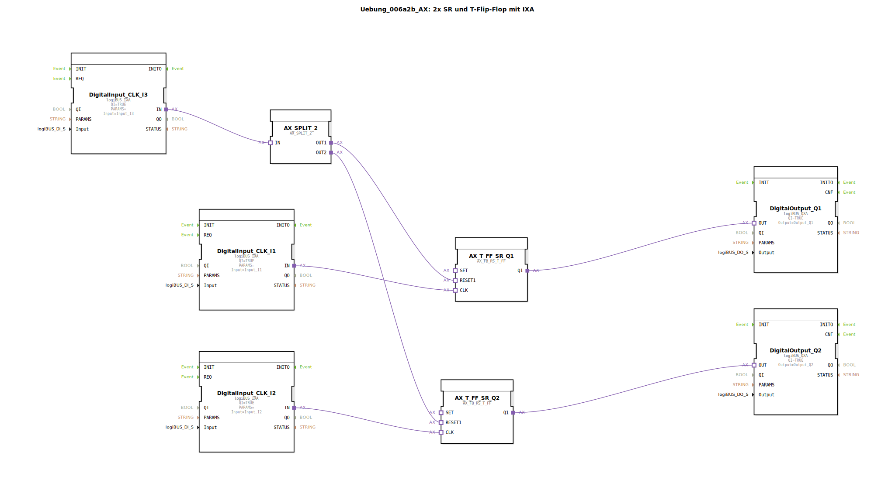

# Uebung_006a2b_AX: 2x SR und T-Flip-Flop mit IXA

<!-- Hier könnte ein Bild eingefügt werden, falls vorhanden. -->

* * * * * * * * * *

## Einleitung

Diese Übung zeigt die Anwendung von SR- und T-Flipflops in Kombination mit einem gemeinsamen Rücksetzsignal („Hausmeister‑Aus“).  
Zwei Digitaleingänge (`I1`, `I2`) schalten die beiden Ausgänge (`Q1`, `Q2`) jeweils um (Toggle). Ein dritter Eingang (`I3`) setzt beide Ausgänge gleichzeitig zurück.  
Dadurch wird das Zusammenspiel bistabiler Elemente und die Ereignisverteilung in 4diac veranschaulicht.

## Verwendete Funktionsbausteine (FBs)

### Sub-Bausteine

#### DigitalInput_CLK_I1
- **Typ**: `logiBUS::io::DI::logiBUS_IXA`
- **Parameter**: `Input = Input_I1`, `QI = TRUE`
- **Funktionsweise**: Stellt den digitalen Tastereingang I1 als Ereignis zur Verfügung. Jede Betätigung erzeugt ein Ereignis am Ausgang `IN`.

#### DigitalInput_CLK_I2
- **Typ**: `logiBUS::io::DI::logiBUS_IXA`
- **Parameter**: `Input = Input_I2`, `QI = TRUE`
- **Funktionsweise**: Stellt den digitalen Tastereingang I2 als Ereignis zur Verfügung.

#### DigitalInput_CLK_I3
- **Typ**: `logiBUS::io::DI::logiBUS_IXA`
- **Parameter**: `Input = Input_I3`, `QI = TRUE`
- **Funktionsweise**: Stellt den digitalen Tastereingang I3 (Resettaster) als Ereignis zur Verfügung.

#### AX_SPLIT_2
- **Typ**: `adapter::events::unidirectional::AX_SPLIT_2`
- **Funktionsweise**: Verteilt ein eingehendes Ereignis (von I3) auf zwei Ausgänge (`OUT1`, `OUT2`). So kann ein einziges Tastersignal gleichzeitig an mehrere Empfänger gesendet werden.

#### AX_T_FF_SR_Q1
- **Typ**: `adapter::bistableElements::AX_FB_RS_T_FF`
- **Funktionsweise**: Kombinierter RS- und T‑Flipflop.  
  - Am Ereigniseingang `CLK` (verbunden mit I1) wird der Ausgang `Q1` bei jeder positiven Flanke umgeschaltet (Toggle).  
  - Der Ereigniseingang `RESET1` (verbunden mit `AX_SPLIT_2.OUT1`) setzt den Ausgang `Q1` zurück.

#### AX_T_FF_SR_Q2
- **Typ**: `adapter::bistableElements::AX_FB_RS_T_FF`
- **Funktionsweise**: Gleichartiger Flipflop wie oben.  
  - `CLK` von I2, `RESET1` von `AX_SPLIT_2.OUT2`.  
  - Steuert den Ausgang `Q2`.

#### DigitalOutput_Q1
- **Typ**: `logiBUS::io::DQ::logiBUS_QXA`
- **Parameter**: `Output = Output_Q1`, `QI = TRUE`
- **Funktionsweise**: Digitalausgang, der den Zustand von `Q1` auf den physikalischen Ausgang `Output_Q1` ausgibt.

#### DigitalOutput_Q2
- **Typ**: `logiBUS::io::DQ::logiBUS_QXA`
- **Parameter**: `Output = Output_Q2`, `QI = TRUE`
- **Funktionsweise**: Digitalausgang, der den Zustand von `Q2` auf den physikalischen Ausgang `Output_Q2` ausgibt.

## Programmablauf und Verbindungen

Die Schaltung arbeitet nach folgendem Prinzip:

1. **T‑Flipflop‑Betrieb**:  
   Jede Betätigung von Taster I1 erzeugt ein Ereignis am `CLK`‑Eingang von `AX_T_FF_SR_Q1`. Der Flipflop wechselt seinen Ausgangszustand (Toggle). Entsprechendes gilt für Taster I2 und `AX_T_FF_SR_Q2`.

2. **Zentraler Reset („Hausmeister‑Aus“)**:  
   Wird Taster I3 gedrückt, wird das Ereignis über den Splitter `AX_SPLIT_2` auf die `RESET1`‑Eingänge beider Flipflops verteilt. Beide Ausgänge (`Q1`, `Q2`) werden sofort zurückgesetzt.

3. **Ausgabe**:  
   Die internen Zustände von `Q1` und `Q2` werden über die Digitalausgänge `Output_Q1` und `Output_Q2` nach außen geführt.

**Lernziele**:  
- Verständnis des Verhaltens von T‑Flipflops und RS‑Flipflops.  
- Ereignisbasierte Programmierung und Weiterleitung mit `AX_SPLIT_2`.  
- Einfaches Zusammenspiel von digitalen Ein‑ und Ausgängen.

**Voraussetzungen**:  
- Grundlegende Kenntnisse der 4diac‑IDE und der Ereignissteuerung nach IEC 61499.

**Ausführung**:  
Die Übung kann direkt in einer 4diac‑Laufzeitumgebung (z. B. FORTE) mit entsprechend konfigurierten logiBUS‑I/O‑Modulen gestartet werden. Taster I1 und I2 schalten die Ausgänge, Taster I3 setzt alles zurück.

## Zusammenfassung

Die Übung „Uebung_006a2b_AX“ implementiert zwei unabhängige T‑Flipflops, die über einen gemeinsamen Rücksetzeingang verfügen.  
Durch die Verwendung der Adapter‑FBs `AX_FB_RS_T_FF` und `AX_SPLIT_2` wird eine kompakte und leicht nachvollziehbare Steuerung realisiert.  
Der Schwerpunkt liegt auf dem Verständnis bistabiler Schaltungen und der ereignisgesteuerten Kommunikation in 4diac.