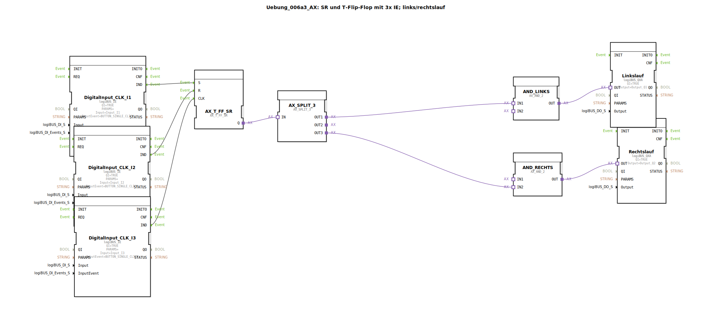

# Uebung_006a3_AX: SR und T-Flip-Flop mit 3x IE; links/rechtslauf

Dieser Artikel beschreibt die logiBUS®-Übung `Uebung_006a3_AX`. Dies ist eine komplexere Anwendung zur Ansteuerung eines Motors mit zwei Drehrichtungen.

----

## Ziel der Übung

Realisierung einer Wende-Schütz-Steuerung mit Software-Verriegelung. Es darf niemals gleichzeitig "Links" und "Rechts" angesteuert werden, da dies einen Kurzschluss im Leistungskreis verursachen würde.

-----

## Beschreibung und Komponenten

[cite_start]Die Subapplikation `Uebung_006a3_AX.SUB` nutzt eine Kombination aus Flip-Flop, Splitter und einer custom Sub-App (`Uebung_006a3_sub_AX`)[cite: 1].

### Funktionsbausteine (FBs)

  * **`I1` (Set)**: Einschalten (in die zuletzt gewählte Richtung oder Default).
  * **`I2` (Reset)**: Ausschalten.
  * **`I3` (Toggle)**: Start/Stopp.
  * **`AX_T_FF_SR`**: Der Hauptspeicher "Motor Ein/Aus".
  * **`AX_SPLIT_3`**: Verteilt das "Motor ist an"-Signal.
  * **`AX_LinksRechts_T_FF` (SubApp)**: Speichert die aktuelle *Richtung* (Links oder Rechts).
  * **2x `AX_AND_2`**: Verriegelungsgatter.

-----

## Funktionsweise

1.  Das `AX_T_FF_SR` bestimmt, ob der Motor überhaupt laufen soll.
2.  Die SubApp `AX_LinksRechts_T_FF` ist ein Richtungs-Speicher (Toggle). Jedes Mal, wenn der Motor eingeschaltet wird (Event von `SPLIT_3.OUT1`), toggelt diese SubApp die Richtung für den *nächsten* oder *aktuellen* Lauf (abhängig von der genauen internen Verschaltung).
3.  Die UND-Gatter verknüpfen "Motor Ein" (`SPLIT_3`) mit "Richtung Links" bzw. "Richtung Rechts".
4.  Dadurch ist sichergestellt, dass immer nur ein Ausgang (`Q1` oder `Q2`) aktiv ist.

*Hinweis: Die genaue Logik des Richtungwechsels (bei jedem Start? oder durch extra Taste?) hängt von der `Uebung_006a3_sub_AX` ab.*

-----

## Anwendungsbeispiel

**Waschmaschine** oder **Rührwerk**: Der Motor soll abwechselnd links und rechts laufen, aber natürlich nie gleichzeitig.