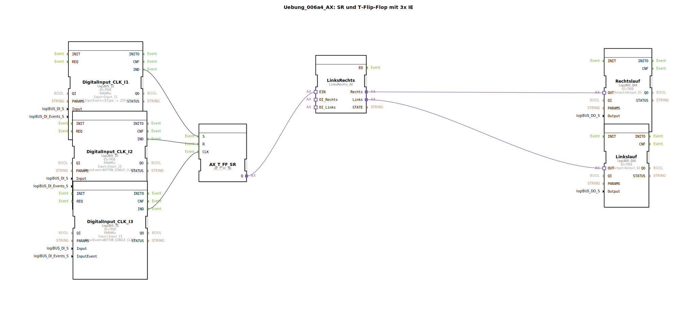

# Uebung_006a4_AX: SR und T-Flip-Flop mit 3x IE

Dieser Artikel beschreibt die logiBUS®-Übung `Uebung_006a4_AX`. Sie ist eine Optimierung von `Uebung_006a3_AX` durch Verwendung eines vorgefertigten Bausteins.

----

## Ziel der Übung

Nutzung von Bibliotheken ("Don't reinvent the wheel").

-----

## Beschreibung und Komponenten

[cite_start]Die Subapplikation `Uebung_006a4_AX.SUB` ersetzt das komplexe Netzwerk aus Gatter und SubApp der vorherigen Übung durch den Baustein `LinksRechts_AX`[cite: 1].

### Funktionsbausteine (FBs)

  * **`LinksRechts`**: Typ `logiBUS::utils::sequence::verteiler::LinksRechts_AX`. Dieser Baustein kapselt die komplette Logik für die Richtungssteuerung und Verriegelung.
  * **`AX_T_FF_SR`**: Liefert weiterhin das "Ein/Aus" Signal an den Eingang `EIN` des Verteilers.

-----

## Funktionsweise

Die Logik ist gekapselt. Der Baustein `LinksRechts_AX` kümmert sich intern darum, das Eingangssignal abwechselnd auf den Ausgang `Links` und `Rechts` zu leiten.

-----

## Vorteil

Der Code ist wesentlich aufgeräumter, lesbarer und weniger fehleranfällig.