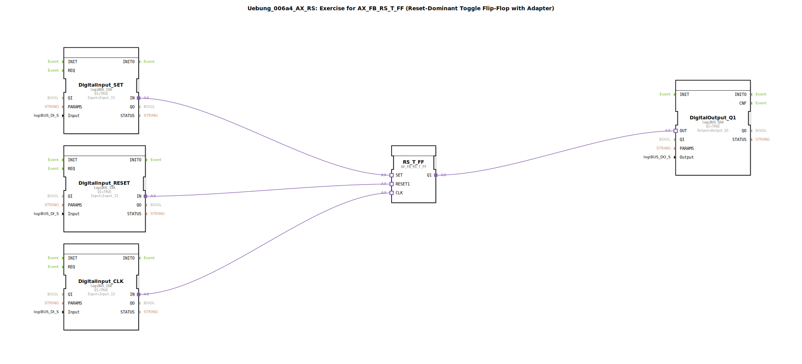

# Uebung_006a4_AX_RS: Exercise for AX_FB_RS_T_FF (Reset-Dominant Toggle Flip-Flop with Adapter)

* * * * * * * * * *
## Einleitung
Diese Übung demonstriert den Einsatz des **Reset-dominanten Toggle-Flipflops (AX_FB_RS_T_FF)** mit Adapter-Schnittstelle in der 4diac-IDE.  
Das Flipflop besitzt drei Eingänge (SET, RESET1, CLK) und einen Ausgang (Q1). Die Schaltung wird über digitale logiBUS-Eingänge (Input_I1 als SET, Input_I2 als RESET, Input_I3 als Takt) gesteuert. Das Ausgangssignal wird auf den logiBUS-Ausgang Output_Q1 gelegt.  
Ziel ist es, das Verhalten eines **reset-dominanten** Toggle-Flipflops zu verstehen und die Verdrahtung mit Adapter-FBs nachzuvollziehen.

## Verwendete Funktionsbausteine (FBs)
- **DigitalInput_SET** (Typ: `logiBUS_IXA`): Liest den logiBUS-Eingang `Input_I1` (SET-Signal).
- **DigitalInput_RESET** (Typ: `logiBUS_IXA`): Liest den logiBUS-Eingang `Input_I2` (RESET-Signal).
- **DigitalInput_CLK** (Typ: `logiBUS_IXA`): Liest den logiBUS-Eingang `Input_I3` (Taktsignal).
- **RS_T_FF** (Typ: `AX_FB_RS_T_FF`): Reset-dominantes Toggle-Flipflop mit Adapter-Schnittstelle.
- **DigitalOutput_Q1** (Typ: `logiBUS_QXA`): Gibt den Zustand des Flipflops an den logiBUS-Ausgang `Output_Q1` aus.

### Parameter
| FB | Parameter | Wert |
|----|-----------|------|
| DigitalInput_SET | `QI` | `TRUE` |
| DigitalInput_SET | `Input` | `Input_I1` |
| DigitalInput_RESET | `QI` | `TRUE` |
| DigitalInput_RESET | `Input` | `Input_I2` |
| DigitalInput_CLK | `QI` | `TRUE` |
| DigitalInput_CLK | `Input` | `Input_I3` |
| DigitalOutput_Q1 | `QI` | `TRUE` |
| DigitalOutput_Q1 | `Output` | `Output_Q1` |

## Programmablauf und Verbindungen
Die logiBUS-Eingänge werden über die Funktionsbausteine `DigitalInput_SET`, `DigitalInput_RESET` und `DigitalInput_CLK` ausgelesen und als Adapter-Sockets an das Flipflop `RS_T_FF` weitergegeben.

**Verbindungen (AdapterConnections):**
- `DigitalInput_SET.IN` → `RS_T_FF.SET`
- `DigitalInput_RESET.IN` → `RS_T_FF.RESET1`
- `DigitalInput_CLK.IN` → `RS_T_FF.CLK`
- `RS_T_FF.Q1` → `DigitalOutput_Q1.OUT`

**Funktionsweise des Flipflops:**
- Bei einer steigenden Flanke am CLK-Eingang toggelt der Ausgang Q1 (d. h. er wechselt seinen Zustand von FALSE zu TRUE oder umgekehrt).
- Ist der RESET1-Eingang aktiv (TRUE), wird der Ausgang **sofort und dominant** auf FALSE gesetzt – unabhängig vom aktuellen Zustand und vom Taktsignal.
- Der SET-Eingang setzt den Ausgang auf TRUE, sofern kein RESET anliegt und kein Taktimpuls ausgeführt wird. Da RESET dominant ist, hat RESET stets Vorrang.

**Lernziele:**
- Verständnis der Funktionsweise eines reset-dominanten Toggle-Flipflops.
- Umgang mit Adapter-basierten Funktionsbausteinen in 4diac.
- Einbindung logiBUS-Hardware-Eingänge/-Ausgänge in ein Automatisierungsprojekt.

**Schwierigkeitsgrad:** Mittel  
**Vorkenntnisse:** Grundlegende Kenntnisse über Flipflops und die 4diac-IDE.

## Zusammenfassung
Die Übung `Uebung_006a4_AX_RS` realisiert ein reset-dominantes Toggle-Flipflop mit drei logiBUS-Eingängen und einem Ausgang. Durch die Adapter-Schnittstelle des Flipflops wird eine klare, funktionale Verbindung zwischen Hardware-Ein-/Ausgängen und der Logik des Bausteins erreicht. Die dominante RESET-Funktion sorgt für ein sicheres Grundverhalten in Steuerungsanwendungen.