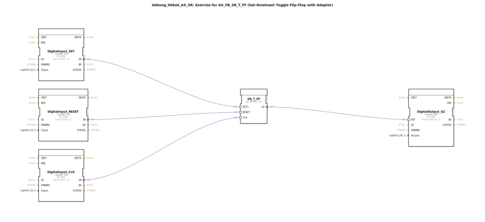

# Uebung_006a4_AX_SR: Exercise for AX_FB_SR_T_FF (Set-Dominant Toggle Flip-Flop with Adapter)

* * * * * * * * * *
## Einleitung

Diese Übung führt in den Funktionsbaustein `AX_FB_SR_T_FF` (Set-Dominant Toggle Flip-Flop) ein, der über Adapter angebunden wird. Ziel ist es, das Verhalten eines setzdominanten Toggle-Flipflops zu verstehen und in einer einfachen Steuerung zu testen.

Der Baustein wird mit drei digitalen Eingängen (SET, RESET, CLK) und einem digitalen Ausgang (Q1) verschaltet. Durch die Verbindung mit den logiBUS-Ein-/Ausgangsbausteinen kann die Schaltung direkt an einer realen Hardware getestet werden.

## Verwendete Funktionsbausteine (FBs)

In dieser Übung werden folgende Funktionsbausteine eingesetzt:

| FB-Name | Typ | Parameter |
|---------|-----|-----------|
| `DigitalInput_SET` | `logiBUS::io::DI::logiBUS_IXA` | Input = `Input_I1` |
| `DigitalInput_RESET` | `logiBUS::io::DI::logiBUS_IXA` | Input = `Input_I2` |
| `DigitalInput_CLK` | `logiBUS::io::DI::logiBUS_IXA` | Input = `Input_I3` |
| `SR_T_FF` | `adapter::bistableElements::AX_FB_SR_T_FF` | (keine Parameter) |
| `DigitalOutput_Q1` | `logiBUS::io::DQ::logiBUS_QXA` | Output = `Output_Q1` |

- **`logiBUS_IXA`**: Digitaler Eingang, der das Signal von einem logiBUS-Eingangskanal über den Adapter einspeist.
- **`AX_FB_SR_T_FF`**: Set-dominantes Toggle-Flipflop mit den Adapter-Schnittstellen `SET1`, `RESET` und `CLK`. Der Ausgang `Q1` toggelt bei jeder positiven Flanke am Clock-Eingang, wenn **SET** aktiv ist; bei aktivem **RESET** wird der Ausgang zurückgesetzt.
- **`logiBUS_QXA`**: Digitaler Ausgang, der das Signal an einen logiBUS-Ausgangskanal weiterleitet.

Es werden keine weiteren Sub-Applikationen (`SubAppType`) innerhalb des Netzwerks verwendet.

## Programmablauf und Verbindungen

Der logische Ablauf der Übung ist wie folgt:

1. **Eingänge**: Die physikalischen Eingänge `Input_I1` (SET), `Input_I2` (RESET) und `Input_I3` (CLK) werden über die drei `logiBUS_IXA`-Bausteine in die 4diac-Umgebung eingelesen.
2. **Flip-Flop**: Die Signale gelangen über Adapterverbindungen zu `SR_T_FF`:
   - `DigitalInput_SET.IN` → `SR_T_FF.SET1`
   - `DigitalInput_RESET.IN` → `SR_T_FF.RESET`
   - `DigitalInput_CLK.IN` → `SR_T_FF.CLK`
3. **Ausgang**: Der Ausgang `SR_T_FF.Q1` wird auf den Digitalausgang `DigitalOutput_Q1.OUT` übertragen und an `Output_Q1` ausgegeben.

**Funktionsweise des SR_T_FF**:
- Bei einem aktiven **Reset** (`RESET = 1`) wird der Ausgang sofort auf `FALSE` gesetzt.
- Ist **Reset** inaktiv und **SET** aktiv, toggelt der Ausgang bei jeder positiven Flanke an `CLK`. (Set-dominant bedeutet, dass ein gleichzeitig aktiver Set die Toggle-Funktion zulässt; bei inaktivem Set wird der Ausgang nicht getoggelt.)
- Sind beide, Set und Reset, inaktiv, bleibt der Ausgang unverändert.

**Lernziele**:
- Verständnis des setzdominanten Toggle-Flipflops und seiner Adapter-Schnittstelle.
- Einbindung von Hardware-Ein-/Ausgängen über logiBUS-Adapter.
- Analyse des zeitlichen Verhaltens bei unterschiedlichen Eingangskombinationen.

**Schwierigkeitsgrad**: Einfach  
**Vorkenntnisse**: Grundlegender Umgang mit der 4diac-IDE, einfache digitale Logik.

## Zusammenfassung

Die Übung `Uebung_006a4_AX_SR` demonstriert die Verwendung des setzdominanten Toggle-Flipflops `AX_FB_SR_T_FF` in einer 4diac-Umgebung. Durch die klare Trennung von Ein-/Ausgangsadaptern und dem eigentlichen Flipflop-Baustein wird eine hardwarenahe Steuerung realisiert, die sich direkt auf einer logiBUS-Plattform testen lässt. Der Schwerpunkt liegt auf dem Verständnis der Toggle-Funktion unter Berücksichtigung des dominanten Set- und Reset-Verhaltens.