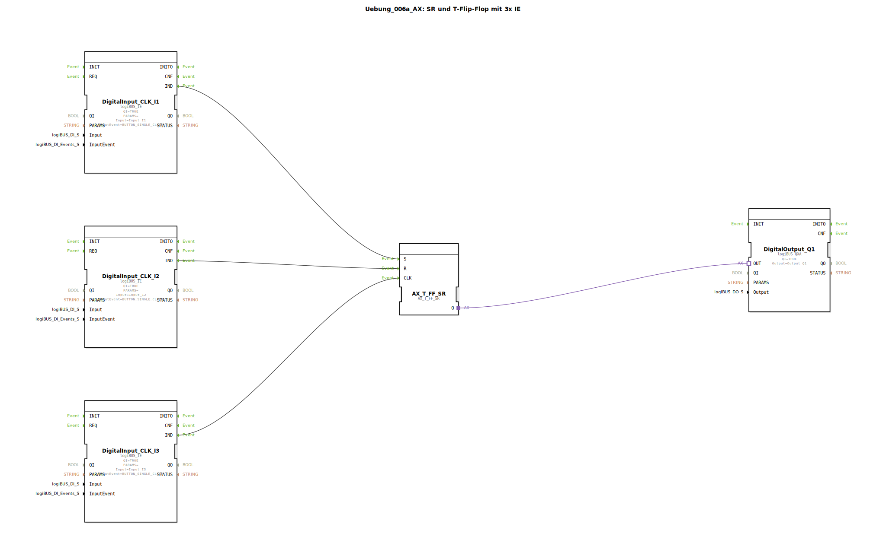

# Uebung_006a_AX: SR und T-Flip-Flop mit 3x IE

Dieser Artikel beschreibt die logiBUS®-Übung `Uebung_006a_AX`. Diese Übung zeigt einen "Alles-Könner"-Baustein.

----

## Ziel der Übung

Kennenlernen des `AX_T_FF_SR`.

-----

## Beschreibung und Komponenten

[cite_start]Die Subapplikation `Uebung_006a_AX.SUB` nutzt drei Taster[cite: 1].

### Funktionsbausteine (FBs)

  * **`I1` (Set)**
  * **`I2` (Reset)**
  * **`I3` (Toggle)**
  * **`AX_T_FF_SR`**: Vereint Toggle, Set und Reset in einem Baustein.

-----

## Funktionsweise

*   `I1` schaltet an.
*   `I2` schaltet aus.
*   `I3` schaltet um.

Dies bietet maximale Flexibilität für die Bedienung.

-----

## Anwendungsbeispiel

**Smart Home Lichtsteuerung**:
*   Taster an der Wand: Toggle (`I3`).
*   Zentral "Alles Aus" beim Verlassen des Hauses: Reset (`I2`).
*   "Panik-Licht" (Alarmanlage): Set (`I1`).