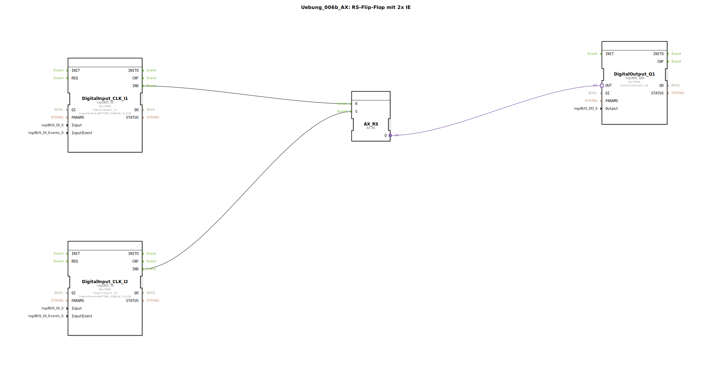

# Uebung_006b_AX: RS-Flip-Flop mit 2x IE

Dieser Artikel beschreibt die logiBUS®-Übung `Uebung_006b_AX`.

----

## Ziel der Übung

Unterschied zwischen SR (Set Priority) und RS (Reset Priority) verstehen.

-----

## Beschreibung und Komponenten

[cite_start]Die Subapplikation `Uebung_006b_AX.SUB` nutzt einen `AX_RS` Baustein[cite: 1].

### Funktionsbausteine (FBs)

  * **`AX_RS`**: Ein RS-Flip-Flop.

-----

## Funktionsweise

Funktional sehr ähnlich zu `AX_SR`. Der Unterschied liegt im Verhalten, wenn **gleichzeitig** (im selben SPS-Zyklus) ein Set- und ein Reset-Event eintreffen (oder wenn beide Eingänge TRUE sind bei pegelgesteuerten Bausteinen).
*   **SR**: Setzen hat Vorrang -> Ausgang wird TRUE.
*   **RS**: Rücksetzen hat Vorrang -> Ausgang wird FALSE.

In der IEC 61499 mit Event-Verarbeitung ist "Gleichzeitigkeit" subtiler, da Events oft sequenziell abgearbeitet werden. Wenn jedoch z.B. durch einen `E_SPLIT` beide Events im selben "Step" ankommen, entscheidet die interne Logik des Bausteins. Beim `AX_RS` gewinnt im Zweifel das Reset.

-----

## Anwendungsbeispiel

**Sicherheitskritische Abschaltung**: Wenn jemand "Start" drückt, während "Not-Aus" gedrückt ist, darf die Maschine **nicht** anlaufen. Daher Reset-Dominanz (RS).