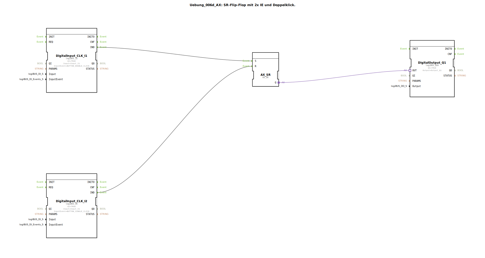

# Uebung_006d_AX: SR-Flip-Flop mit 2x IE und Doppelklick.

Dieser Artikel beschreibt die logiBUS®-Übung `Uebung_006d_AX`.

----

## Ziel der Übung

Kombination von Input-Events und Speichergliedern.

-----

## Beschreibung und Komponenten

[cite_start]Die Subapplikation `Uebung_006d_AX.SUB` definiert eine asymmetrische Bedienung[cite: 1].

### Funktionsbausteine (FBs)

  * **`I1` (Set)**: Konfiguriert auf `BUTTON_DOUBLE_CLICK`.
  * **`I2` (Reset)**: Konfiguriert auf `BUTTON_SINGLE_CLICK`.
  * **`AX_SR`**: Speicher.

-----

## Funktionsweise

*   Zum **Einschalten** muss man den Taster `I1` **doppelt** klicken.
*   Zum **Ausschalten** reicht ein **einfacher** Klick auf `I2`.

-----

## Anwendungsbeispiel

**Schutz vor versehentlichem Einschalten**: Ein Gerät (z.B. eine Pumpe), das gefährlich sein kann oder viel Energie verbraucht, soll nicht durch ein versehentliches Berühren des Schalters starten. Der Doppelklick fordert eine bewusste Handlung ("Ja, ich will wirklich"). Das Ausschalten muss hingegen im Notfall schnell und einfach gehen (Einzelklick).