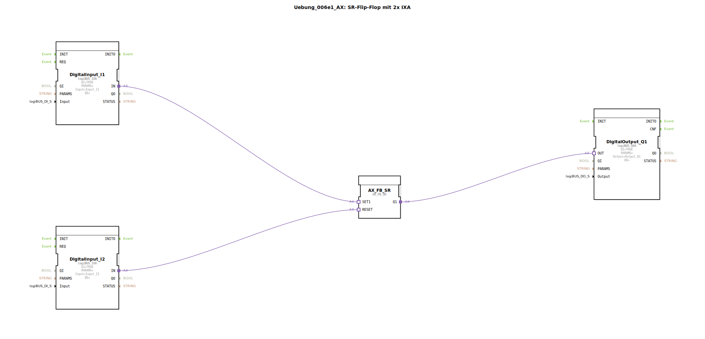

Hier ist die Dokumentation für die Übung `Uebung_006e1_AX` basierend auf den bereitgestellten Daten.

# Uebung_006e1_AX: SR-Flip-Flop mit 2x IXA

* * * * * * * * * *

## Einleitung

Diese Übung implementiert ein **SR-Flip-Flop** (bistabiles Kippglied) unter Verwendung von **Adapter-Technologie** (AX/IX/QX). Die Logik dient dazu, einen digitalen Ausgang über einen Eingang zu setzen (Set) und über einen zweiten Eingang zurückzusetzen (Reset). Durch die Verwendung von Adaptern werden Daten- und Ereignisflüsse in einzelnen Verbindungen gebündelt, was die Übersichtlichkeit im Plan erhöht.

## Verwendete Funktionsbausteine (FBs)

In dieser Sub-Applikation werden spezifische Bausteine für die Ein- und Ausgabe über den logiBUS sowie ein Logikbaustein für das Flip-Flop verwendet.

### Sub-Bausteine: Uebung_006e1_AX

Hier sind die internen Funktionsbausteine aufgeführt, die in diesem Netzwerk verschaltet sind:

- **Typ**: SubAppType
- **Verwendete interne FBs**:

    - **DigitalInput_I1**: `logiBUS::io::DI::logiBUS_IXA`
        - **Parameter**: 
            - `Input` = "Input_I1"
            - `QI` = TRUE (sichtbar: false)
        - **Beschreibung**: Dieser Baustein stellt den ersten digitalen Eingang dar (Setzen). Er nutzt einen Adapter-Ausgang (`IN`), um den Zustand an die Logik weiterzugeben.

    - **DigitalInput_I2**: `logiBUS::io::DI::logiBUS_IXA`
        - **Parameter**: 
            - `Input` = "Input_I2"
            - `QI` = TRUE (sichtbar: false)
        - **Beschreibung**: Dieser Baustein stellt den zweiten digitalen Eingang dar (Rücksetzen). Er nutzt ebenfalls einen Adapter-Ausgang (`IN`).

    - **DigitalOutput_Q1**: `logiBUS::io::DQ::logiBUS_QXA`
        - **Parameter**: 
            - `Output` = "Output_Q1"
            - `QI` = TRUE (sichtbar: false)
        - **Beschreibung**: Dieser Baustein repräsentiert den digitalen Ausgang. Er empfängt Signale über einen Adapter-Eingang (`OUT`).

    - **AX_FB_SR**: `adapter::iec61131::bistableElements::AX_FB_SR`
        - **Beschreibung**: Dies ist der Kern-Logikbaustein. Es handelt sich um ein SR-Flip-Flop, das speziell für die Verwendung mit Adaptern ausgelegt ist. Es besitzt Adapter-Eingänge für `SET1` und `RESET` sowie einen Adapter-Ausgang für `Q1`.

## Programmablauf und Verbindungen

Das Netzwerk realisiert eine Speicherfunktion mittels eines SR-Flip-Flops. Der Ablauf und die Adapter-Verbindungen gestalten sich wie folgt:

1.  **Setzen (Set):**
    *   Der Adapter-Ausgang `IN` von **DigitalInput_I1** ist mit dem Adapter-Eingang `SET1` des **AX_FB_SR** Bausteins verbunden.
    *   Wird `Input_I1` aktiv, wird das Flip-Flop gesetzt.

2.  **Rücksetzen (Reset):**
    *   Der Adapter-Ausgang `IN` von **DigitalInput_I2** ist mit dem Adapter-Eingang `RESET` des **AX_FB_SR** Bausteins verbunden.
    *   Wird `Input_I2` aktiv, wird das Flip-Flop zurückgesetzt.

3.  **Ausgabe:**
    *   Der Adapter-Ausgang `Q1` des **AX_FB_SR** Bausteins ist mit dem Adapter-Eingang `OUT` von **DigitalOutput_Q1** verbunden.
    *   Der Status des Flip-Flops wird direkt an den physischen Ausgang `Output_Q1` weitergeleitet.

**Besonderheit der Adapter:**
Anstatt separate Ereignis- (Events) und Datenleitungen zu ziehen, werden hier Adapter-Verbindungen (dargestellt durch die Doppelpfeile/breiteren Linien in der IDE) genutzt. Dies reduziert die Anzahl der sichtbaren Leitungen drastisch.

**Logikverhalten (SR-Dominanz):**
Da es sich um einen SR-Baustein handelt, gilt typischerweise: Ist nur Setzen aktiv, ist der Ausgang 1. Ist nur Rücksetzen aktiv, ist der Ausgang 0. Sind beide Eingänge gleichzeitig aktiv, bestimmt der Bausteintyp die Dominanz (bei SR-Bausteinen nach IEC 61131 hat oft das Setzen Vorrang, dies ist jedoch implementationabhängig vom spezifischen `AX_FB_SR`).

## Zusammenfassung

Die Übung `Uebung_006e1_AX` demonstriert effizient den Einsatz von Adapter-Technologie zur Realisierung einer klassischen Speicherfunktion (SR-Flip-Flop). Durch die Verwendung der `logiBUS_IXA` und `logiBUS_QXA` Bausteine wird die Verbindung zur Hardware abstrahiert, während der `AX_FB_SR` die logische Verknüpfung übernimmt.