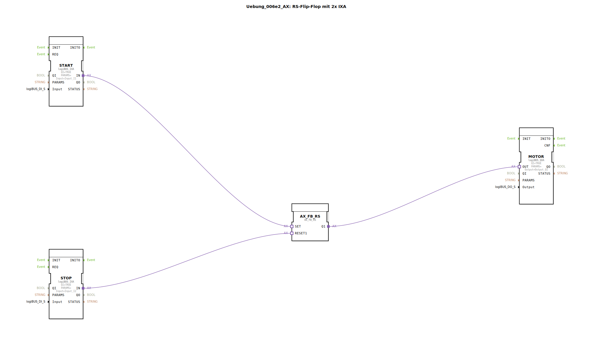

Hier ist die Dokumentationsseite für die Übung `Uebung_006e2_AX` basierend auf den bereitgestellten XML-Daten.

# Uebung_006e2_AX: RS-Flip-Flop mit 2x IXA

* * * * * * * * * *

## Einleitung
Die Übung **Uebung_006e2_AX** realisiert ein RS-Flip-Flop (Rücksetz-Dominant) unter Verwendung von Adapter-Verbindungen (AX). Ziel der Übung ist es, zwei digitale Eingänge zu nutzen, um einen digitalen Ausgang zu setzen (Set) oder zurückzusetzen (Reset). Dabei wird die Logikbaustein-Bibliothek für bistabile Elemente verwendet und über das logiBUS-System mit der Hardware abstrahiert.

## Verwendete Funktionsbausteine (FBs)

In dieser Sub-Applikation werden spezifische Funktionsbausteine für die Ein- und Ausgabe sowie die logische Verarbeitung verwendet.

### Sub-Bausteine: Uebung_006e2_AX
Diese Übung selbst ist als `SubAppType` definiert und enthält folgende interne Komponenten:

- **Typ**: SubAppType
- **Verwendete interne FBs**:
    - **DigitalInput_I1**: `logiBUS::io::DI::logiBUS_IXA`
        - Parameter: `Input` = "Input_I1"
        - Parameter: `QI` = "TRUE"
        - Beschreibung: Adapter-Baustein für den ersten digitalen Eingang.
    - **DigitalInput_I2**: `logiBUS::io::DI::logiBUS_IXA`
        - Parameter: `Input` = "Input_I2"
        - Parameter: `QI` = "TRUE"
        - Beschreibung: Adapter-Baustein für den zweiten digitalen Eingang.
    - **DigitalOutput_Q1**: `logiBUS::io::DQ::logiBUS_QXA`
        - Parameter: `Output` = "Output_Q1"
        - Parameter: `QI` = "TRUE"
        - Beschreibung: Adapter-Baustein für den digitalen Ausgang.
    - **AX_FB_RS**: `adapter::iec61131::bistableElements::AX_FB_RS`
        - Beschreibung: Ein bistabiles Element (RS-Flip-Flop) mit Adapter-Schnittstellen. Es realisiert die Speicherfunktion.

- **Funktionsweise**: 
    Die Sub-Applikation liest zwei externe Signale über die logiBUS-Adapter ein, verarbeitet diese in einem RS-Flip-Flop und gibt den resultierenden Zustand an einen Ausgangsadapter weiter.

## Programmablauf und Verbindungen

Der Programmablauf wird durch Adapter-Verbindungen (`AdapterConnections`) realisiert, die sowohl Daten als auch Ereignisse kapseln.

1.  **Setzen des Speichers (Set):**
    -   Der Adapter `DigitalInput_I1.IN` ist mit dem Adapter-Eingang `AX_FB_RS.SET` verbunden.
    -   Wenn der Eingang `Input_I1` aktiviert wird, wird das RS-Flip-Flop gesetzt.

2.  **Rücksetzen des Speichers (Reset):**
    -   Der Adapter `DigitalInput_I2.IN` ist mit dem Adapter-Eingang `AX_FB_RS.RESET1` verbunden.
    -   Wenn der Eingang `Input_I2` aktiviert wird, wird das RS-Flip-Flop zurückgesetzt.

3.  **Ausgabe des Zustands:**
    -   Der Adapter-Ausgang `AX_FB_RS.Q1` ist mit dem Adapter `DigitalOutput_Q1.OUT` verbunden.
    -   Der aktuelle Zustand des Flip-Flops wird somit direkt an den physischen Ausgang `Output_Q1` weitergeleitet.

**Lernziele:**
-   Verständnis von bistabilen Elementen (RS-Flip-Flop).
-   Umgang mit Adapter-Verbindungen (AX/IXA/QXA) in 4diac zur Vereinfachung des Signalflusses.
-   Verknüpfung von Hardware-IOs mit logischen Funktionen.

## Zusammenfassung
Die `Uebung_006e2_AX` demonstriert eine grundlegende Speicherfunktion in der Steuerungstechnik. Durch die Verwendung von Adaptern (`AX_FB_RS`, `logiBUS_IXA`, `logiBUS_QXA`) wird der Schaltplan übersichtlich gehalten, da Ereignis- und Datenflüsse in einer einzigen Verbindungslinie zusammengefasst sind. Das Verhalten entspricht einem klassischen RS-Flip-Flop, bei dem `Input_I1` als Set-Eingang und `Input_I2` als Reset-Eingang fungiert.