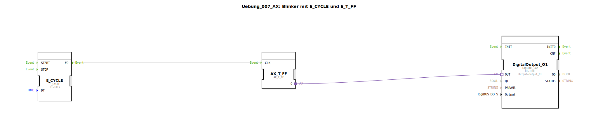

# Uebung_007_AX: Blinker mit E_CYCLE und E_T_FF

Dieser Artikel beschreibt die logiBUS®-Übung `Uebung_007_AX`. Hier wird gezeigt, wie man zeitgesteuerte Ereignisse erzeugt.

----

## Ziel der Übung

Erzeugung eines periodischen Blinksignals.

-----

## Beschreibung und Komponenten

[cite_start]Die Subapplikation `Uebung_007_AX.SUB` nutzt einen `E_CYCLE` Baustein in Kombination mit einem Flip-Flop[cite: 1].

### Funktionsbausteine (FBs)

  * **`E_CYCLE`**: Ein Ereignis-Generator. Er sendet periodisch Events am Ausgang `EO`. Der Parameter `DT` bestimmt die Periodendauer (hier `T#1s`).
  * **`AX_T_FF`**: Das Toggle-Flip-Flop.
  * **`DigitalOutput_Q1`**: Die Lampe.

-----

## Funktionsweise

1.  Der `E_CYCLE` Baustein feuert jede Sekunde ein Event.
2.  Das Event erreicht das Flip-Flop (`AX_T_FF.CLK`).
3.  Das Flip-Flop schaltet um (An -> Aus -> An ...).
4.  Die Lampe blinkt mit einer Frequenz von 0,5 Hz (1 Sekunde an, 1 Sekunde aus).

-----

## Anwendungsbeispiel

**Warnleuchte**: Eine Signallampe soll blinken, um Aufmerksamkeit zu erregen.