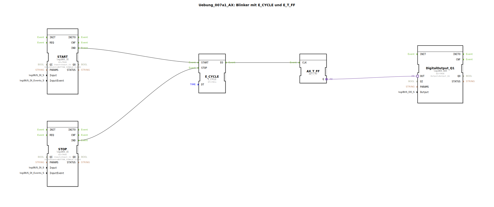

# Uebung_007a1_AX: Blinker mit E_CYCLE und E_T_FF

Dieser Artikel beschreibt die logiBUS®-Übung `Uebung_007a1_AX`.

----

## Ziel der Übung

Starten und Stoppen des Blinkers.

-----

## Beschreibung und Komponenten

[cite_start]Die Subapplikation `Uebung_007a1_AX.SUB` nutzt die Eingänge `START` und `STOP` des `E_CYCLE` Bausteins[cite: 1].

### Funktionsbausteine (FBs)

  * **`START` (I1)**: Startet den Zyklus.
  * **`STOP` (I2)**: Stoppt den Zyklus.
  * **`E_CYCLE`**: Generiert Events nur, wenn er gestartet ist.

-----

## Problem

Wie im Kommentar der Subapplikation vermerkt ("dieser Blinker bleibt zufällig auf AN oder AUS stehen"):
Wenn man `STOP` drückt, hört der `E_CYCLE` auf, Events zu senden. Das Flip-Flop `AX_T_FF` behält aber seinen *letzten* Zustand bei. War die Lampe gerade an, bleibt sie dauerhaft an. Das ist meistens nicht gewünscht (eine gestoppte Warnleuchte sollte aus sein).

-----

## Anwendungsbeispiel

Zeigt, warum man beim Design von Zustandsautomaten den "Stopp-Zustand" definieren muss.