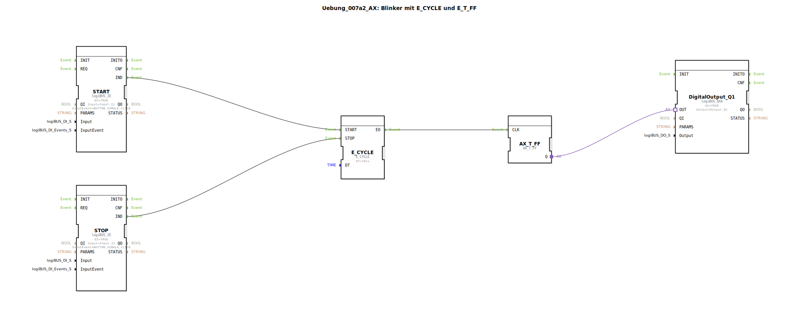

# Uebung_007a2_AX: Blinker mit E_CYCLE und E_T_FF

Dieser Artikel beschreibt die logiBUS®-Übung `Uebung_007a2_AX`.

----

## Ziel der Übung

Untersuchung des Verhaltens.

-----

## Beschreibung

[cite_start]Strukturell sehr ähnlich zu `Uebung_007a1_AX`[cite: 1]. Auch hier besteht das Problem des undefinierten Endzustands der Lampe. Es dient vermutlich als Wiederholung oder Variation im Layout.

-----

## Fazit

Auch diese Lösung ist für sicherheitskritische Blinker ungeeignet.

