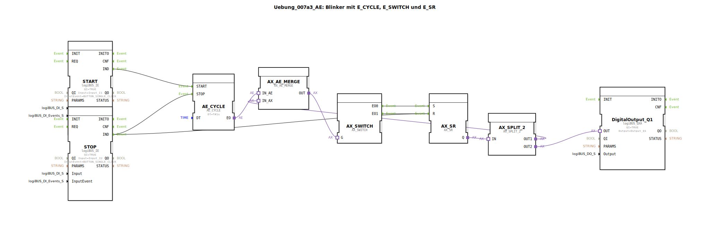

# Uebung_007a3_AE: Blinker mit E_CYCLE, E_SWITCH und E_SR

* * * * * * * * * *

## Einleitung

In dieser Übung wird ein Blinker realisiert, der einen digitalen Ausgang (Output_Q1) periodisch ein- und ausschaltet. Die Ansteuerung erfolgt über zwei Taster (Start/Stop). Als zentrale Elemente werden die Funktionsbausteine `AE_CYCLE` (Timer), `AX_SWITCH` (Umschalter), `AX_SR` (Setz-Rücksetz-Flipflop) sowie weitere Adapterbausteine verwendet. Die Besonderheit dieser Schaltung: Der Ausgang bleibt im ausgeschalteten Zustand definitiv aus – es kommt zu keinem ungewollten Einschalten.

## Verwendete Funktionsbausteine (FBs)

- **DigitalOutput_Q1** (Typ: `logiBUS::io::DQ::logiBUS_QXA`)  
  - Parameter: `QI` = TRUE, `Output` = "Output_Q1"  
  - Adapterbaustein zur Ansteuerung eines physischen digitalen Ausgangs.

- **AE_CYCLE** (Typ: `adapter::events::unidirectional::timers::AE_CYCLE`)  
  - Parameter: `DT` = T#1s (Periodendauer 1 Sekunde)  
  - Zyklischer Timer, der nach einem Start-Ereignis in regelmäßigen Abständen ein Ereignis ausgibt.

- **START** (Typ: `logiBUS::io::DI::logiBUS_IE`)  
  - Parameter: `QI` = TRUE, `Input` = "Input_I1", `InputEvent` = "BUTTON_SINGLE_CLICK"  
  - Eingangsbaustein für einen Taster. Bei einem einfachen Tastendruck wird ein Ereignis `IND` ausgelöst.

- **STOP** (Typ: `logiBUS::io::DI::logiBUS_IE`)  
  - Parameter: `QI` = TRUE, `Input` = "Input_I2", `InputEvent` = "BUTTON_SINGLE_CLICK"  
  - Gleicher Typ wie START, dient zum Stoppen des Timers und Rücksetzen des Flipflops.

- **AX_SR** (Typ: `adapter::events::unidirectional::AX_SR`)  
  - Ereignisgesteuertes Setz-/Rücksetz-Flipflop. Die Eingänge `S` (Set) und `R` (Reset) werden über Ereignisse aktiviert; der Ausgang `Q` liefert ein Adaptersignal.

- **AX_SWITCH** (Typ: `adapter::events::unidirectional::AX_SWITCH`)  
  - Ereignisgesteuerter Umschalter. Abhängig vom Wert des Eingangs `G` wird das eingehende Signal entweder auf den Ausgang `EO0` oder `EO1` weitergeleitet.

- **AX_AE_MERGE** (Typ: `adapter::events::unidirectional::AX_AE_MERGE`)  
  - Vereinigt einen Adaptereingang (`IN_AX`) und einen Ereigniseingang (`IN_AE`) zu einem gemeinsamen Ausgangssignal (`OUT`).

- **AX_SPLIT_2** (Typ: `adapter::events::unidirectional::AX_SPLIT_2`)  
  - Verteilt ein eingehendes Adaptersignal auf zwei identische Ausgänge (`OUT1` und `OUT2`).

## Programmablauf und Verbindungen

1. **Start** – Ein Tastendruck an Input_I1 (START) erzeugt ein Ereignis `IND`, das an den `START`-Eingang von `AE_CYCLE` geleitet wird. Der Timer beginnt zu laufen.

2. **Stop** – Ein Tastendruck an Input_I2 (STOP) erzeugt ein Ereignis `IND`, das sowohl an den `STOP`-Eingang von `AE_CYCLE` (Timer stoppt) als auch an den `R`-Eingang von `AX_SR` (Flipflop wird zurückgesetzt) geführt wird.

3. **Zyklus** – Der Timer `AE_CYCLE` erzeugt jede Sekunde ein Ereignis an seinem Ausgang `EO`. Dieses Ereignis wird mit dem Adaptersignal von `AX_SR` (`Q`) über `AX_AE_MERGE` zusammengeführt und an den `G`-Eingang von `AX_SWITCH` gesendet.

4. **Umschaltung** – `AX_SWITCH` leitet das ankommende Signal (vom Merge) abhängig vom Pegel an `G` entweder auf `EO0` (verbunden mit `S` von `AX_SR`) oder auf `EO1` (verbunden mit `R` von `AX_SR`). Dadurch wird bei jedem Timer-Impuls der Zustand des Flipflops umgeschaltet.

5. **Ausgabe** – Der Ausgang `Q` von `AX_SR` wird über `AX_SPLIT_2` auf zwei Wege verteilt:
   - `OUT1` geht zurück zu `AX_AE_MERGE` (über `IN_AX`), um die Rückkopplung zu schließen.
   - `OUT2` wird zum Eingang `OUT` von `DigitalOutput_Q1` geführt und schaltet den physischen Ausgang (Output_Q1).

**Lernziele**  
- Verständnis ereignisgesteuerter Ablaufsteuerung mit Timer, Flipflop und Umschalter.  
- Umgang mit Adapter-Bausteinen in der 4diac-IDE.  

**Schwierigkeitsgrad**: Mittel  
**Vorkenntnisse**: Grundlagen der 4diac-IDE und ereignisgesteuerte Funktionsbausteine.  
**Start**: Nach dem Laden der SubApp in ein Projekt kann sie durch Zuweisung der Ein-/Ausgänge an die Hardware getestet werden.

## Zusammenfassung

Die Übung **Uebung_007a3_AE** demonstriert einen robusten Blinker, der durch die Kombination von zyklischem Timer, Umschalter und Setz-/Rücksetz-Flipflop realisiert wird. Durch die spezielle Verschaltung wird sichergestellt, dass der Ausgang nach einem Stopp zuverlässig ausgeschaltet bleibt. Der Aufbau eignet sich hervorragend zur Einführung in ereignisgesteuerte Logik mit Adaptern und zeigt, wie aus einfachen Grundbausteinen ein funktionales Steuerungsprogramm entsteht.