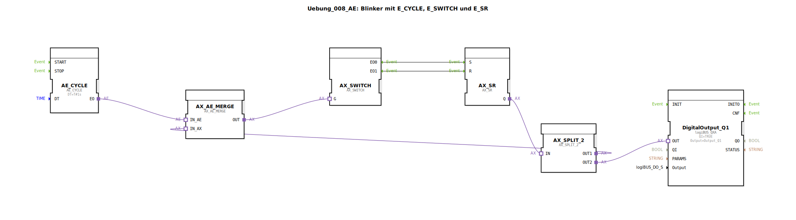

# Uebung_008_AE: Blinker mit E_CYCLE, E_SWITCH und E_SR

* * * * * * * * * *
## Einleitung

Diese Übung realisiert einen einfachen Blinker (Wechselblinker) unter Verwendung von Adapter-Funktionsbausteinen (FBs) für die ereignisgesteuerte Logik. Der Kern besteht aus einem Zyklusgeber (AE_CYCLE), einem Umschalter (AX_SWITCH) und einem SR-Flipflop (AX_SR). Über einen Aufteiler (AX_SPLIT_2) und einen Zusammenführer (AX_AE_MERGE) wird die Rückkopplung und die Ausgabe auf einen digitalen Ausgang realisiert. Die Übung demonstriert die Nutzung von Ereignis- und Adapterverbindungen in der 4diac-IDE.

## Verwendete Funktionsbausteine (FBs)

Alle verwendeten Bausteine sind Adapter-FBs aus den Bibliotheken `adapter::events::unidirectional::timers` und `adapter::events::unidirectional`. Zusätzlich kommt ein Hardwareausgang (logiBUS) zum Einsatz.

### AE_CYCLE
- **Typ**: `adapter::events::unidirectional::timers::AE_CYCLE`
- **Parameter**:
  - `DT` = `T#1s` (Zykluszeit 1 Sekunde)
- **Ereignisausgang**:
  - `EO`: Zyklischer Ereignisimpuls alle 1 s
- **Funktion**: Erzeugt einen periodischen Ereignisimpuls. Wird als Taktgeber für den Blinker verwendet.

### AX_SWITCH
- **Typ**: `adapter::events::unidirectional::AX_SWITCH`
- **Parameter**: Keine
- **Ereigniseingang**:
  - `G`: Schalteingang (Gate)
- **Ereignisausgänge**:
  - `EO0`: Aktiv, wenn das eingehende Ereignis den Zustand „Aus" darstellt
  - `EO1`: Aktiv, wenn das eingehende Ereignis den Zustand „Ein" darstellt
- **Funktion**: Schaltet ein eingehendes Ereignis entweder auf Ausgang 0 oder 1, abhängig vom aktuellen Zustand eines internen Umschalters. Hier wird das zurückgeführte Ereignis über `AX_AE_MERGE.OUT` an den Gate-Eingang gelegt und abwechselnd das Setzen (S) und Rücksetzen (R) des SR-Flipflops getriggert.

### AX_SR
- **Typ**: `adapter::events::unidirectional::AX_SR`
- **Parameter**: Keine
- **Ereigniseingänge**:
  - `S`: Setzen (Ereignis setzt Ausgang Q auf true)
  - `R`: Rücksetzen (Ereignis setzt Ausgang Q auf false)
- **Adapterausgang**:
  - `Q`: Adapterausgang (trägt den booleschen Zustand; wird an den Aufteiler weitergegeben)
- **Funktion**: Realisiert ein SR-Flipflop auf Ereignisebene. Der Ausgang Q wird bei einem Impuls auf S gesetzt und bei einem Impuls auf R zurückgesetzt.

### AX_SPLIT_2
- **Typ**: `adapter::events::unidirectional::AX_SPLIT_2`
- **Parameter**: Keine
- **Adaptereingang**:
  - `IN` (Eingang eines Adapters, der den Zustand des SR-Flipflops übernimmt)
- **Adapterausgänge**:
  - `OUT1`: Erste Kopie des Eingangs (wird zur Rückkopplung an den Schalter verwendet)
  - `OUT2`: Zweite Kopie des Eingangs (wird an den digitalen Ausgang geführt)
- **Funktion**: Verteilt den eingehenden Adapter (Zustand) auf zwei parallele Pfade.

### AX_AE_MERGE
- **Typ**: `adapter::events::unidirectional::AX_AE_MERGE`
- **Parameter**: Keine
- **Adaptereingänge**:
  - `IN_AX`: Adaptereingang (Zustand vom Aufteiler)
  - `IN_AE`: Ereigniseingang (vom Zyklusgeber)
- **Adapter-/Ereignisausgang**:
  - `OUT`: Adapterausgang (kombiniert den Adapterzustand mit dem Ereignis)
- **Funktion**: Verbindet einen Adapter (Datenzustand) mit einem Ereignis. Der ausgehende Adapter enthält den Zustand von `IN_AX` und wird durch das Ereignis `IN_AE` getriggert. Dadurch wird der aktuelle Zustand des SR-Flipflops an den Schalter weitergegeben, sobald das Zyklusereignis eintrifft.

### DigitalOutput_Q1
- **Typ**: `logiBUS::io::DQ::logiBUS_QXA`
- **Parameter**:
  - `QI` = `TRUE` (immer aktiviert)
  - `Output` = `Output_Q1` (physischer Ausgangskanal)
- **Adaptereingang**:
  - `OUT` (erhält den Bool-Zustand von `AX_SPLIT_2.OUT2`)
- **Funktion**: Schaltet den physischen digitalen Ausgang Q1 entsprechend des anliegenden Bool-Werts (TRUE = ein, FALSE = aus). Der Ausgang leuchtet bei gesetztem SR-Flipflop.

## Programmablauf und Verbindungen

Der Blinker arbeitet ereignisgesteuert nach folgendem Schema:

1. **Taktgeber**: Der `AE_CYCLE` sendet alle 1 Sekunde ein Ereignis auf seinem Ausgang `EO`.
2. **Ereignis-Rückführung**: Das Ereignis von `AE_CYCLE` wird mit dem aktuellen Zustand des SR-Flipflops kombiniert. Dazu wird der Zustand vom `AX_SR` über `AX_SPLIT_2` an den `AX_AE_MERGE` (Eingang `IN_AX`) geleitet. Das Ereignis von `AE_CYCLE` wird an `IN_AE` angelegt. Der `AX_AE_MERGE` erzeugt an seinem Ausgang `OUT` einen Adapter, der den Zustand trägt und zeitgleich mit dem Ereignis ausgeliefert wird.
3. **Schalter**: Der Ausgang `AX_AE_MERGE.OUT` wird an den Eingang `G` des `AX_SWITCH` gelegt. Der Schalter wertet den ankommenden Adapterzustand aus:
   - Bei Zustand `false` (Flipflop zurückgesetzt) wird ein Ereignis an `EO0` ausgegeben.
   - Bei Zustand `true` (Flipflop gesetzt) wird ein Ereignis an `EO1` ausgegeben.
4. **SR-Flipflop**: 
   - Ein Ereignis von `AX_SWITCH.EO0` gelangt an den Setzeingang `S` des `AX_SR`. Damit wird der Flipflop gesetzt → Ausgang `Q` wird `true`.
   - Ein Ereignis von `AX_SWITCH.EO1` gelangt an den Rücksetzeingang `R` des `AX_SR`. Damit wird der Flipflop zurückgesetzt → Ausgang `Q` wird `false`.
5. **Ausgabe**: Über `AX_SPLIT_2` wird der Zustand `Q` auf zwei Pfade verteilt:
   - `OUT1` → Rückkopplung an `AX_AE_MERGE` (wie beschrieben)
   - `OUT2` → An den Adaptereingang `OUT` des `DigitalOutput_Q1`. Bei `true` wird der Ausgang eingeschaltet, bei `false` ausgeschaltet.

Der Kreislauf wiederholt sich mit jedem Takt von `AE_CYCLE`. Dadurch wechselt der Ausgang Q1 periodisch zwischen Ein- und Ausgeschaltet (Blinken mit 1 s Takt).

## Zusammenfassung

Die Übung „Uebung_008_AE" zeigt den Aufbau eines Blinkers mit Hilfe von 4diac-Adaptern. Zentral sind die Bausteine `AE_CYCLE` (Takt), `AX_SWITCH` (Zustandsverarbeitung), `AX_SR` (Flipflop), `AX_SPLIT_2` (Signalverteilung) und `AX_AE_MERGE` (Kombination von Ereignis und Adapter). Die ereignisbasierte Rückkopplung erzeugt eine wechselnde Ein-/Aus-Logik, die auf einen physischen Ausgang gegeben wird. Die Übung vermittelt den Umgang mit Adapterverbindungen, Ereignisrückkopplungen und dem Entwurf sequenzieller Schaltungen in der 4diac-IDE.