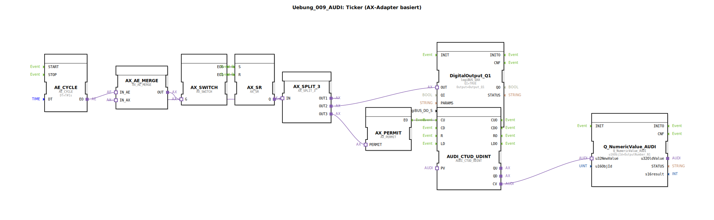

# Uebung_009_AUDI: Ticker (AX-Adapter basiert)

* * * * * * * * * *

## Einleitung

Diese Übung demonstriert die Realisierung eines **Tickers** auf Basis von **AX-Adaptern** (Adapter-Ereignis-Schnittstellen) in der 4diac-IDE.  
Ziel ist es, einen Zähler (up/down) zu implementieren, der über einen Schalter (AX_SWITCH), ein Set-Reset-Glied (AX_SR) und ein Erlaubnissignal (AX_PERMIT) gesteuert wird. Der aktuelle Zählerstand wird auf einem digitalen Ausgang und einem numerischen Anzeigeblock ausgegeben.

Die Übung ist Teil der **Uebungen**-Bibliothek und nutzt vordefinierte Adapterbausteine sowie einen CTUD-Zähler. Sie eignet sich für Fortgeschrittene, die das Zusammenspiel von Ereignissen und Adaptern verstehen möchten.

## Verwendete Funktionsbausteine (FBs)

Die Übung besteht aus einer **SubApp** (Uebung_009_AUDI), die mehrere interne Funktionsbausteine enthält. Die SubApp selbst hat keine eigenen Ein-/Ausgangsschnittstellen; alle Signale werden über interne Verbindungen verarbeitet.

### Sub-Bausteine: Uebung_009_AUDI (SubApp)

- **Typ**: SubAppType
- **Verwendete interne FBs**:
  - **DigitalOutput_Q1**: `logiBUS::io::DQ::logiBUS_QXA`
    - Parameter: `QI` = `TRUE`, `Output` = `Output_Q1`
    - Funktion: Stellt den digitalen Ausgang `Output_Q1` auf dem logiBUS bereit.
  - **AE_CYCLE**: `adapter::events::unidirectional::timers::AE_CYCLE`
    - Parameter: `DT` = `T#1s`
    - Funktion: Erzeugt zyklisch alle 1 Sekunde ein Ereignis an seinem Ausgang `EO`.
  - **AX_SWITCH**: `adapter::events::unidirectional::AX_SWITCH`
    - Parameter: keine
    - Funktion: Ein AX-Adapter-Schalter, der zwei Ereignisausgänge (`EO0`, `EO1`) besitzt. Welcher Ausgang aktiv wird, hängt vom eingehenden Adapter-Ereignis ab (Toggle-Funktion).
  - **AX_SR**: `adapter::events::unidirectional::AX_SR`
    - Parameter: keine
    - Funktion: Set-Reset-Speicher mit AX-Adapter-Schnittstelle. Die Eingänge `S` und `R` setzen bzw. rücksetzen den Ausgang `Q`.
  - **AX_PERMIT**: `adapter::events::unidirectional::AX_PERMIT`
    - Parameter: keine
    - Funktion: Ein Erlaubnis-Glied: Nur wenn am Eingang `PERMIT` ein Ereignis eintrifft, wird das an `IN` anliegende Ereignis an den Ausgang `EO` weitergeleitet.
  - **AUDI_CTUD_UDINT**: `adapter::events::unidirectional::AUDI_CTUD_UDINT`
    - Parameter: keine
    - Funktion: Zähler mit Vorwärtszählen (CU) und optionale Zählrichtung. Liefert den aktuellen Zählerwert als `UDINT` an `CV`.
  - **Q_NumericValue_AUDI**: `isobus::UT::Q::Q_NumericValue_AUDI`
    - Parameter: `u16ObjId` = `OutputNumber_N1`
    - Funktion: Gibt den übergebenen Zahlenwert (`u32NewValue`) in ein isobus-Netzwerk aus (Objekt-ID `OutputNumber_N1`).
  - **AX_SPLIT_3**: `adapter::events::unidirectional::AX_SPLIT_3`
    - Parameter: keine
    - Funktion: Verteilt ein eingehendes AX-Ereignis an drei Ausgänge (`OUT1`, `OUT2`, `OUT3`).
  - **AX_AE_MERGE**: `adapter::events::unidirectional::AX_AE_MERGE`
    - Parameter: keine
    - Funktion: Vereinigt zwei Ereigniseingänge: einen AX-Adapter (`IN_AX`) und einen reinen Ereigniseingang (`IN_AE`). Das kombinierte Signal wird am Ausgang `OUT` ausgegeben.

## Programmablauf und Verbindungen

Der Ablauf der Übung lässt sich wie folgt beschreiben:

1. **Taktgenerierung**  
   `AE_CYCLE` erzeugt alle 1 Sekunde ein Ereignis (EO).

2. **Ereignisvereinigung**  
   Dieses Ereignis wird zusammen mit dem Signal von `AX_SPLIT_3.OUT1` (siehe Schritt 4) über `AX_AE_MERGE` zusammengeführt. Das Ergebnis wird an `AX_SWITCH.G` (Gate-Eingang) weitergeleitet.

3. **Schalterbetrieb**  
   `AX_SWITCH` reagiert auf das eingehende Ereignis und schaltet zwischen seinen beiden Ausgängen `EO0` und `EO1` um. Dies simuliert ein manuelles oder logisches Umschalten.

4. **Set-Reset-Glied**  
   `EO0` geht an `AX_SR.S` (Set), `EO1` an `AX_SR.R` (Reset). Der Ausgang `Q` des SR-Glieds wird aktiv, solange gesetzt, und deaktiviert bei Reset.

5. **Signalverteilung**  
   Das Signal von `AX_SR.Q` wird auf `AX_SPLIT_3.IN` gegeben und auf drei Ausgänge verteilt:
   - `OUT1` → zurück zur Ereignisvereinigung `AX_AE_MERGE.IN_AX`.
   - `OUT2` → an den **digitalen Ausgang** `DigitalOutput_Q1.OUT`. Damit wird der Ausgang `Output_Q1` gesetzt, solange das SR-Glied gesetzt ist.
   - `OUT3` → an `AX_PERMIT.PERMIT`.

6. **Erlaubnis und Zähler**  
   `AX_PERMIT` gibt das Ereignis nur dann an `EO` weiter, wenn am `PERMIT`-Eingang ein Ereignis anliegt. Dieses wird an den Zähler `AUDI_CTUD_UDINT.CU` gesendet. Der Zähler erhöht seinen Wert bei jedem Ereignis.

7. **Numerische Ausgabe**  
   Der aktuelle Zählerstand (`CV`) wird an den `Q_NumericValue_AUDI`-Block übergeben und als numerischer Wert auf dem isobus-Netzwerk (Objekt-ID `OutputNumber_N1`) ausgegeben.

**Lernziele**:  
- Verständnis von AX- und AE-Adaptern (Ereignis- und Adapter-Schnittstellen)  
- Anwendung eines SR-Speichers, eines Schalters und eines Erlaubnisglieds  
- Verknüpfung von zyklischen Ereignissen mit manueller Steuerung  
- Ausgabe auf digitalen und numerischen Kanälen

**Schwierigkeitsgrad**: Fortgeschritten  
**Vorkenntnisse**: Grundlagen der 4diac-IDE, Ereignisgesteuerte Abläufe, Arbeit mit Adaptern

## Zusammenfassung

Die Übung `Uebung_009_AUDI` implementiert einen tickergesteuerten Zähler mit Hilfe von AX-Adapter-Bausteinen.  
Ein zyklischer Timer (`AE_CYCLE`) liefert den Takt, der über einen Schalter (`AX_SWITCH`) und ein Set-Reset-Glied (`AX_SR`) den Zähler freigibt. Der Zählerstand wird gleichzeitig als digitales Signal auf einem logiBUS-Ausgang und als numerischer Wert auf einem isobus-Netzwerk ausgegeben.  
Die Verwendung von Adaptern erlaubt eine flexible, ereignisorientierte Verkettung und demonstriert die modulare Struktur der 4diac-IDE.