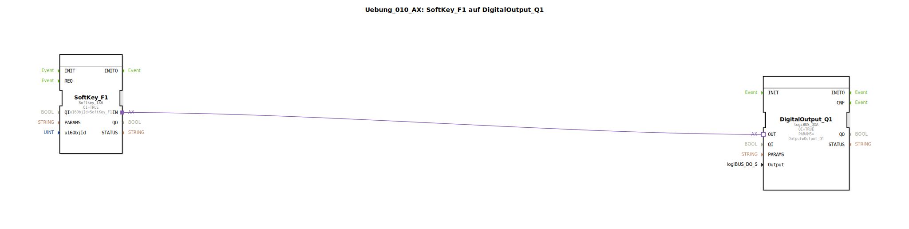

# Uebung_010_AX: SoftKey_F1 auf DigitalOutput_Q1

Dieser Artikel beschreibt die logiBUS®-Übung `Uebung_010_AX`. Hier betreten wir die Welt des ISOBUS (ISO 11783). Anstelle von physischen Eingängen nutzen wir virtuelle Tasten auf einem Terminal (Universal Terminal, UT).

## 🎧 Podcast

* [ISO 11783-6: Softkeys und das Virtual Terminal verstehen – Dein Schlüssel zur Landmaschinen-Mechatronik](https://podcasters.spotify.com/pod/show/isobus-vt-objects/episodes/ISO-11783-6-Softkeys-und-das-Virtual-Terminal-verstehen--Dein-Schlssel-zur-Landmaschinen-Mechatronik-e36a8b0)

----

## Ziel der Übung

Verwendung eines `Softkey`-Bausteins zur Steuerung eines Ausgangs.

-----

## Beschreibung und Komponenten

[cite_start]Die Subapplikation `Uebung_010_AX.SUB` verbindet eine Softkey-Instanz mit einem digitalen Ausgang[cite: 1].

### Funktionsbausteine (FBs)

  * **`SoftKey_F1`**: Typ `isobus::UT::io::Softkey::Softkey_IXA`. Dieser Baustein repräsentiert die Taste "F1" auf dem Bildschirm des ISOBUS-Terminals.
  * **`DigitalOutput_Q1`**: Der physische Ausgang.

### Parameter

*   `u16ObjId`: Verweist auf die Objekt-ID des Softkeys im Objekt-Pool (hier `SoftKey_F1`).

-----

## Funktionsweise

Die Funktionsweise ist identisch zu einem physischen Taster. Solange der Nutzer den Finger auf dem Touchscreen (oder die Taste am Rand) hält, liefert der Baustein `TRUE`. Lässt er los, wird `FALSE` gesendet.

-----

## Anwendungsbeispiel

**Maschinenfunktion einschalten**: Der Fahrer drückt auf dem Bildschirm das Symbol für "Arbeitsscheinwerfer", und das Licht geht an (solange er drückt).