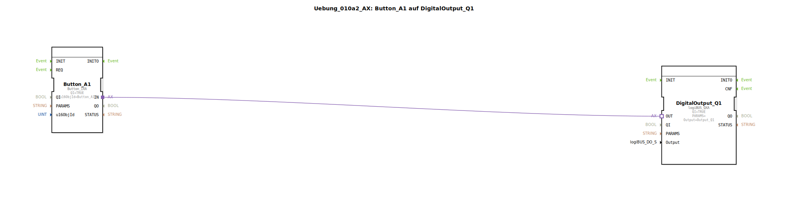

# Uebung_010a2_AX: Button_A1 auf DigitalOutput_Q1

Dieser Artikel beschreibt die logiBUS®-Übung `Uebung_010a2_AX`. Neben Softkeys (F-Tasten) gibt es im ISOBUS auch "Buttons" (Schaltflächen im Datenmasken-Bereich).

----

## Ziel der Übung

Verwendung eines `Button_IXA`.

-----

## Beschreibung und Komponenten

[cite_start]Die Subapplikation `Uebung_010a2_AX.SUB` nutzt einen Button anstelle eines Softkeys[cite: 1].

### Funktionsbausteine (FBs)

  * **`Button_A1`**: Typ `isobus::UT::io::Button::Button_IXA`. Referenziert `Button_A1`.

-----

## Funktionsweise

Funktional identisch zum Softkey, jedoch visuell an einem anderen Ort auf dem Terminal. Ein "Button" ist Teil der Arbeitsmaske, ein "Softkey" ist Teil der fixen Menüleiste.